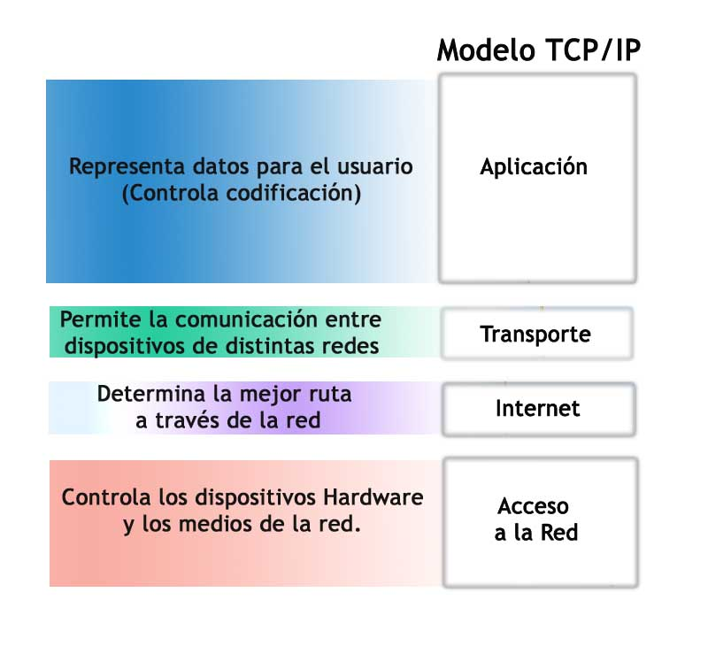
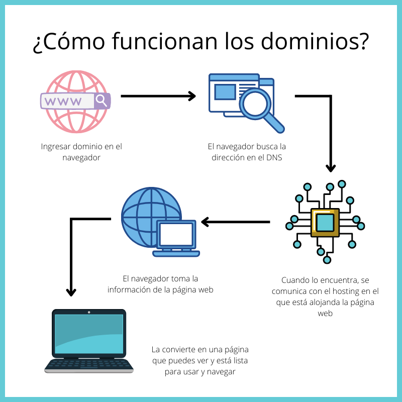
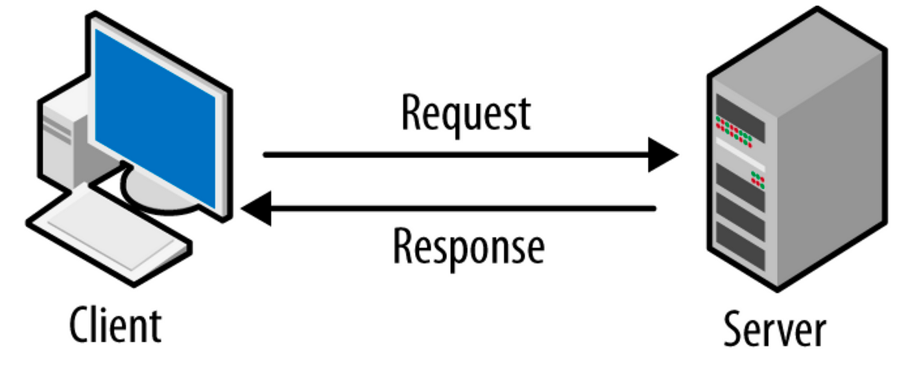
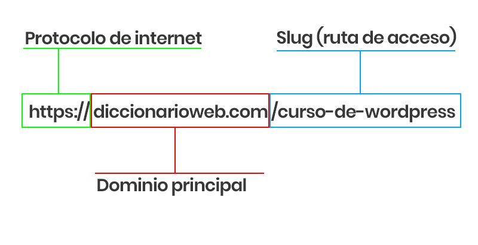
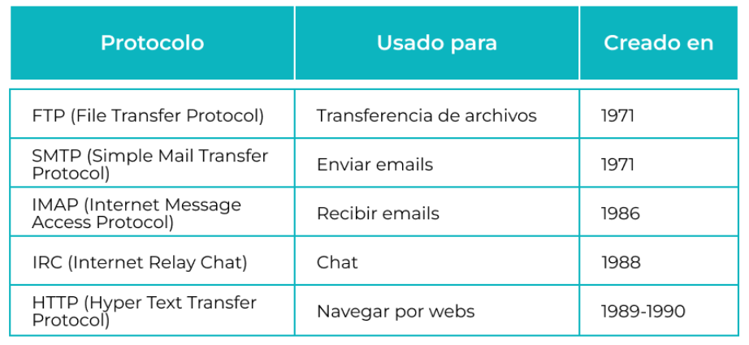
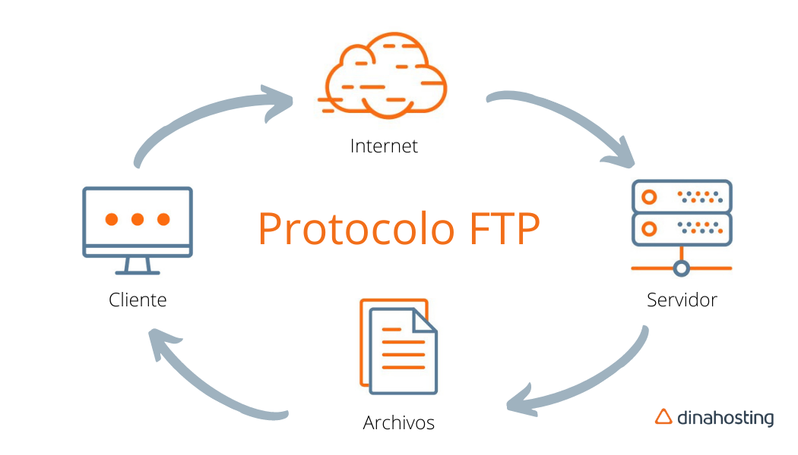

- [MODULO1-ARQUITECTURA CLIENTE-SERVIDOR](#modulo-1-arquitectura-cliente-servidor)
    
- [1.INTERNET, IP, TCP , UDP y más protocolos.](#1--internet-ip-tcp--udp-y-más-protocolos)
  - [1.1¿Qué es Internet?](#11¿qué-es-internet)
  - [1.2¿Qué es una dirección IP?](#12¿qué-es-una-dirección-ip)
    - [Publicas](#tipos-de-direcciones-ip)
    - [Privadas](#tipos-de-direcciones-ip)
    - [TCP](#tcp)
    - [UDP](#udp)
  - [1.3¿Que es un dominio?](#13-¿que-es-un-dominio) - [Partes de dominio](#partes-de-un-dominio) - [Funcionamiento del dominio](#funcionmiento-del-dominio)
      
- [2. LA WEB Y SUS COMPONENTES](#2-la-web-y-sus-componente)
  - [2.1 ¿Qué es una página web?](#21-¿qué-es-una-página-web)
    - [Almacenamiento y acceso](#almacenamiento-y-acceso)
  - [2.2 ¿Qué es un servidor?](#22-¿qué-es-un-servidor)
    - [Servidor](#servidor)
    - [Cliente](#cliente)
  - [2.3 ¿Qué es una URL?](#23-¿qué-es-una-url) - [Partes de una URL](#partes-de-una-url)
      
- [3. Protocolos de comunicación en la web](#3-protocolos-de-comunicación-en-la-web)
  - [3.1 ¿Qué es un protocolo?](#31-¿qué-es-un-protocolo)
  - [3.2 ¿Qué es FTP?](#32-¿qué-es-ftp)
    - [Conexión FTP a tu servidor de hosting](#conexión-ftp-a-tu-servidor-de-hosting)
  - [3.3 ¿Qué es HTTP?](#33-¿qué-es-http) - [Proceso de consulta de una web](#proceso-de-consulta-de-una-web)
      
- [4. Entendiendo la web](#4-entendiendo-la-web)

  - [4.1 Web estática vs web dinámica](#41-web-estática-vs-web-dinámica)
    - [Web estática](#web-estática)
    - [Web dinámica](#web-dinámica)
  - [4.2 Estructura de una web](#42-estructura-de-una-web)

  - [4.3 El archivo index.html](#43-el-archivo-indexhtml)
       

- <e>[ENLACES]</e>

  - [Proyecto Arpanet](#conceptos-básicos)
  - [Página de compra y registro de dominios web](#conceptos-básicos)
  - [Conceptos básicos sobre el internet](#conceptos-básicos)
  - [Conceptos básicos sobre la web](#conceptos-básicos)
  - [Para profundizar más en html](#para-profundizar-más-en-html-httpwwww3schoolscomhtmlhtml_introasp)
  - [Página web de FireZilla](#protocolos-de-comunicación-en-la-web)

    

<t> MODULO 1- ARQUITECTURA CLIENTE-SERVIDOR </t>

 

# 1 . INTERNET, IP, TCP , UDP y más protocolos.

## 1.1¿Qué es Internet?

> <text> Internet != web </text>  

 
Creado en 1969 (Arpanet)  basado en TCP(protocolo para asegurar de que llega los datos correctamente)/IP(para saber a quien va a llegar la informacion enviar la informacion).

Conjunto descentralizado de redes interconectados entre sí, que funcionan como una red lógica de alcance mundial.

 

---

---

 

## 1.2¿Qué es una dirección IP?

> **IP** = "Internet Protocol" 

Es un protocolo de comunicación que hace uso de direcciones para crear paquetes de información y los envía = Es una etiqueta numerica de 4 numeros, de entre 0 a 225. (xxx.xxx.xxx.xxx)
 

### <u>Tipos de direcciones IP:</u>

Hay IPv4 y IPv6.  
<text> Actualmente se usa IPv4, IPv6 es mejor pero mas complejo así que no se usa tanto por ahora.</text>

#### <u>Direcciones IP **publicas**: </u>

Estas se utiliza para identificar dispositivos en _internet_.  
IANA provee a los ISP estas direcciones. (La dirección que usa el mundo para encontrarte a ti, o que usas tú para encontrar servicios en el mundo.)

> **IANA**= (Internet Assigned Numbers Authority) _Organizacion de asignación numérica._   > **ISP** = (Internet Service Provider) _Provedores de servicios de internet._

 

#### <u>Direcciones IP **privadas**: </u>

Estas se utiliza para identificar dispositivos en una _red local_. (red formada típicamente por un router WIFI) (192.168.0.X) 
Son asignadas por el administrador de la red. 

> **LAN** = (Local Area Network) _Red local._

  

Las direcciones IP identificaN de manera lógica y gráfica a una interfaz (dispositivo) conectada a una red, que utilice el protocolo de internet o que corresponda al nivel de red del modelo TPC/IP. 

 

### <u>TCP</u>

 
> **TCP-IP** = (Transmission Control Protocol/Internet Protocol)  

TCP/IP es un protocolo convinado que consiste en un enlace de datos que se usa en Internet para que los ordenadores y otros dispositivos envien y reciban datos. 

#### <u>Hay 4 capas:</u>

    1. Interfaz de red / Acceso a la red
    2. Internet
    3. Transporte
    4. Aplicación

 

### <u>UDP</u>

 
> UDP = User Datagram Protocol

    User Datagram Protocol, o UDP, es un protocolo de comunicación que se utiliza en Internet para transmisiones sujetas a limitaciones temporales, como la reproducción de vídeo o las búsquedas en DNS. Acelera las comunicaciones al no establecer formalmente una conexión antes de transferir los datos.

#### TCP vs UDP

 

Otros protocolos que usamos a menudo pero que serán menos importantes para nuestro día a día son: 

- FTP (File Transfer Protocol), para transferencia de datos (os suena FileZilla?)
- SMTP (Simple Mail Transfer Protocol), para envío de emails
- IMAP (Internet Message Access Protocol), para recepción de emails.

 

 

---

---

 

## 1.3 ¿Que es un dominio?

    Volviendo al DNS, y recordando que las direeciones IP se componen de 4 bloques de cifras de entre 0 y 255, y que nadie quiere tener que recordar esos numerajos, existió gente muy inteligente ideó el Sistema de Nombres de Dominio. (DNS)

> ** DNS ** = Domain Name System

Fué creado en 1985 
Traduce las dirrecciones IP a lenguaje escrito. 
No es posible comprar un dominio, solo alquilarlo a empresas que gestionan los dominios de Internet  <c>(registradores de dominios)</c>

 

<b>Preguntar a Pablo

    Su abstracción hace posible que cualquier servicio de red pueda moverse de un lugar geográfico a otro. De este modo, es posible que la IP que da acceso a una web varíe; aumentando de paso el número de webs posibles, de un número finito a uno (teóricamente) infinito.

- Las direcciones IP cambain en el momento de que te desconectas de internet, la direccion IP que tenias es asignada a otro dispositivo.

--------</b>

### <u>Partes de un dominio:</u>

| TLD - Top Level Domain DOMINIO NIVEL SUPERIOR                                              | NOMBRE DE DOMINIO                                          | SUBDOMINIO                                                                                                      |
| ---------------------------------------------------------------------------------------------------------- | ---------------------------------------------------------- | --------------------------------------------------------------------------------------------------------------- |
| <u>GENERICOS:</u> .com, .org, .net   <u>ESPECIFICOS:</u> .es, .it, .uk   <u>OTROS:</u> .madrid, .sex | Parte central   Sin espacios o puntos   _Google.com_ | www   Apunta a una seccion dentro del domino  En este caso "blog" en <blog.google>   es el subdominio. |

 

### <u>Funcionmiento del dominio:</u>

/ El cliente busca algo en internet <c>=></c> el navegador manda la solicitud a <c>=></c> DNS que lo traduce la busqueda a una dirrección IP /  
/ Cuando encuentra la busqueda se comunica con el hosting<c>=></c> y el navegador toma esa información <c>=></c>para luego mostrarla como pagina web /  

 

---

---

 
  

# 2. La web y sus componentes

**World Wide Web (WWW o la Web)**

    Es un conjunto de protocolos que permite, de forma sencilla, la consulta remota de archivos. El conjunto de la web forma Internet.

> <text> Internet != web </text>  

    La web fue un desarrollo creado en torno a 1990, que utiliza Internet como medio de transmisión.

 

    Existen muchos otros servicios y protocolos que hacen uso de Internet:

    - El envío de correo electrónico (SMTP)
    - La transmisión de archivos (FTP y P2P)
    - Las conversaciones en línea (IRC)
    - La mensajería instantánea
    - La transmisión de contenido y comunicación multimedia (telefonía (VoIP), televisión (IPTV)
    - Los juegos en línea
    - Videollamadas y trabajos colaborativos o en la nube

 

---

---

 

## 2.1 ¿Qué es una página web?

    Es un documento generalmente en formato HTML o XHTML, adaptado para la llamada World Wide Web, que puede ser accedido mediante un navegador.
    Proporciona navegación (acceso) a otras páginas web mediante enlaces de hipertexto.
    Incluyen otros recursos como hojas de estilo en cascada, scripts, etc.

 

### <u>Almacenamiento y acceso:</u>

 

| Las paginas web pueden estar <c>almacenadas</c> en un equipo local o en un servidor web remoto |
| ---------------------------------------------------------------------------------------------- |

| El <c>acceso</c> a una pagina web se realiza mediante transferencias desde servidores, utilizando el protocolo de transferencia de hipertexto <c> HTTPS</c> |
| ----------------------------------------------------------------------------------------------------------------------------------------------------------- |

 

    Dos dispositivos que están conectados vía Internet mediante la cual se intercambian información.
    En estos intercambios:

        CLIENTE = Equipo que solicita la informacion |SERVIDOR = El que sirve la información

 

 

---

---

 

## 2.2 ¿Qué es un servidor?

    Generalmente una conexion a través de internet se lleva a cabo únicamente entre 2 ordenadores.

                                Servidor y cliente

### <u>Servidor:</u>

- <text>Almacena información</text>

| Un software <c>capaz de atender las peticiones de un cliente</c> y devolver una respuesta en concordancia. |
| ---------------------------------------------------------------------------------------------------------- |

| Un ordenador <c>siembre conectado a internet</c> cuyo único propósito es <c>entregar el contenido</c>, que a su vez, aloja un software tipo "servidor". |
| ------------------------------------------------------------------------------------------------------------------------------------------------------- |

### <u>Cliente:</u>

- <text> Por lo general no almacenan la información</text>

| Es un programa que <c>piden información </c>, y tambien pueden enviarla. |
| ------------------------------------------------------------------------ |

    Toma muchas formas; Un navegador web (como Firefox), un cliente de correo electrónico (como Outlook), una aplicación de mensajería (como Whatsapp), un servicio de streaming de vídeo (como Netflix).

### <u>Ventajas de la arquitectura cliente-servidor:</u>

- <v><u>Estabilidad:</u></v> Se puede ampliar para acomodar un mayor número de usuarios.
- <v><u>Seguridad:</u></v> Proteger los datos (los datos sensibles se podrían almacenar en el servidor)
- <v><u>Eficiencia:</u></v> Las tareas se pueden dividir entre el cliente y el servidor.

 

---

---

 

## 2.3 ¿Qué es una URL?

> <c> **URL**</c> = Uniform Resource Locator

    Una URL es única y define el contenido y donde se supone que el equipo debe leerlo (http://).
    Es la manera de pedir información por parte de un cliente a un servidor es ecribiendo la URL en el buscador.

### <u>Partes de una URL:</u>

    La URL está formada por la dirección completa que da acceso a una determinada página web.
    (Protocolo: https ; Subdominio: www ; Dominio: google ; TLD: com ; Ruta:/flores/rosas ; Query: ?espinas=no)

 

 

| 1. <c><u>Protocolo:</u></c> Indica el protocolo que se utiliza para acceder al recurso. El protocolo más común es <c>HTTP </c>(Hypertext Transfer Protocol). |
| ------------------------------------------------------------------------------------------------------------------------------------------------------------ |

| 2. <c><u>Subdominio, dominio y TLD :</u></c> Identifica el servidor web que alberga el recurso (<e> Por ejemplo, www.dominio.com.</e>) |
| -------------------------------------------------------------------------------------------------------------------------------------- |

| 3. <c><u>Ruta:</u></c> Identifica el recurso específico en el servidor web. (<e> Por ejemplo, /html/html_intro.html.</e>) |
| ------------------------------------------------------------------------------------------------------------------------- |

| 4. <c><u>Query:</u></c> es un conjunto de palabras o frase que se utiliza cómo término de búsqueda en cualquier buscador. Se trata de las consultas y preguntas que realizan los usuarios en los motores de búsqueda. |
| --------------------------------------------------------------------------------------------------------------------------------------------------------------------------------------------------------------------- |

 

---

---

 
 

# 3. Protocolos de comunicación en la web

## 3.1 ¿Qué es un protocolo?

    Parte esencial de Internet. Los ordenadores lo usan para comunicarse entre sí.
    Permiten a los usuarios acceder a recursos, datos y servicios de todo el mundo.

  

 

---

---

 

## 3.2 ¿Qué es FTP?

> <c>**FTP**</c> = File Transfer Protocol

    Es un protocolo de transferencia de archivos que se utiliza para transferir archivos entre ordenadores (servidor-cliente).

  

#### El <u>servidor</u> será el que ha asignado la empresa de hosting que has contratado   

   

#### Y el <u>cliente</u> es el dispositivo utilizado para conectarte a este servidor.  

  

    Es un protocolo de estado = "Mantiene la información sobre las conexiones y las transferencias"

    FTP utiliza los comandos PASV y PORT para establecer una conexión entre el cliente y el servidor.

### <u>Conexión FTP a tu servidor de hosting </u>  

- Desde el cPanel de tu cuenta de hosting.
- Programas que existen para crear conexiones FTP. <e>File Zilla</e>

 

### <u>Como funciona el hosting</u>

 

 

---

---

 

## 3.3 ¿Qué es HTTP?

 

> <text> Protocolo sin estado </text> = Cada solicitud es independiente

    Protocolo más utilizado para transferir páginas web.
    HTTP utiliza:
        - GET: Para solicitar recursos.
        - POST: Para enviar los datos al servidor.

 

            CORRECTO FUNCIONAMIENTO =

            CLIENTE ( Realizando una petición http o https a través de un navegador)

                                                 +

            SERVIDOR ( Donde esté almacenada esa información)

 

#### <u> Proceso de consulta de una web </u>

 

---

---

 
 

## 4. Entendiendo la web

### 4.1 Web estática vs web dinámica

<text>Una misma web puede contener secciones estáticas y dinámicas.</text>

#### Web estática:

    Contenido estatico = el cliente solo puede ver la pagina de manera informativa, no puede interactuar para modificar su contenido.

#### Web dinámica:

        El contenido de la página puede cambiar, en respuesta a diferentes contextos o condiciones.

            Se pueden crear de dos lados:

                - Del lado del cliente:
                    Cambios en el comportamiento de la interfaz dentro del navegador del usuario.
                    Estos cambios pueden ser respuesta a acciones del usuario.

                        EJEMPLOS: (Hacer click en un boton, introducir un texto, mover el ratón o incluso eventos en tiempo específico)

                    Esto se gestiona desde el navegador del usuario, sin necesidad de recargar la página completa.
                    JavaScript permite que esto suceda en tiempo real.

                - Del lado del usuario:
                    Implica cambios en la fuente de la página suministrada al navegador.
                    En este caso, la lógica y la generación de contenido se realiza en el servidor antes de enviar la página al navegador del usuario.
                    Estos cambios afectan al contenido que se envía al navegador y como se representa al usuario.

                        EJEMPLOS: (Cambiar la información en la página en función de la autentificación del usuario,
                        ajustar la secuencia de páginas en una aplicación,
                        recargar la página web completa en respuesta a una solicutud del usuario.)

                        LENGUAJES DEL SERVIDOR MAS COMUNES PARA GESTIONAR LA LÓGICA DEL LADO DEL SERVIDOR:
                            PHP, Phyton (con framework como Django), Ruby (con frameworks como Ruby on Rails)
                            También se utilizan tecnlogías como ASP.NET en entornode Microsoft.

 

---

---

 

### 4.2 Estructura de una web

<c>DIRECTORIO</c> = "Contenedor virtual en el que se almacena una agrupaci'on de archivos informatico"

<C> RAÍZ</c> = es el primer nivel del directorio

 

---

---

 

### 4.3 El archivo index.html

<text> Es recomendable tener un archivo index.html, no solo en la raíz, sino en cualquier otro subdirectorio. </text><text>  Esto impide que una página de error 404</text> 

---

    Los sitios web están construidos dentro de directorios en un servidor. Con cada página web como un archivo separado.
    Un servidor puede configurarse para reconocer cualquier archivo que se desee como predeterminado

 

    Página por defecto = index.html

 
 
 
 
 

---

---

## <u>ENLACES</u>

#### INTERNET, IP, TCP , UDP y más protocolos:

- Proyecto Arpanet: https://www.wikiwand.com/es/ARPANET

- Página de compra y registro de dominios web: https://www.arsys.es/dominios/nuevos?acp=169599243&avl=11005616163|nuevos dominios|1t1|&gclid=CJitrej6u8wCFeQp0wodl9cNTA

- Conceptos básicos sobre el internet: https://thevalleyofcode.com/the-internet

- Conceptos básicos sobre la web: https://thevalleyofcode.com/the-web

---

---

#### La web y sus componentes:

- Para profundizar más en html: http://www.w3schools.com/html/html_intro.asp

---

---

#### Protocolos de comunicación en la web:

- Página web de FireZilla: https://filezilla-project.org/

---

---
