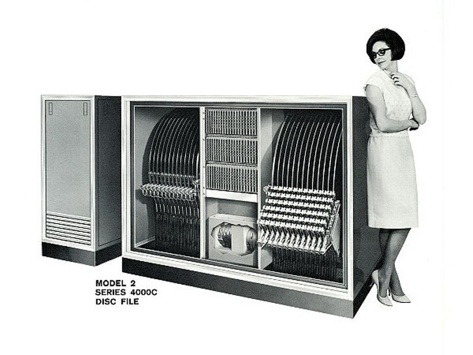

- [Módulo 1: Arquitectura cliente-servidor](#módulo-1-arquitectura-cliente-servidor)
  - [1. Bases](#1-bases)
    - [Internet](#internet)
    - [Breve historia de Internet](#breve-historia-de-internet)
    - [Breve inciso](#breve-inciso)
    - [Se mete el gobierno](#se-mete-el-gobierno)
  - [2. IPs, TCP, UDP y demás protocolos](#2-ips-tcp-udp-y-demás-protocolos)
    - [IP y sus direcciones](#ip-y-sus-direcciones)
    - [DNS y dominios](#dns-y-dominios)
  - [3. La web](#3-la-web)
    - [Que es una página web?](#que-es-una-página-web)
    - [...? Cliente? Servidor?](#-cliente-servidor)
    - [La "tienda" (URLs)](#la-tienda-urls)
    - [HTTP(S)](#https)
    - [Tipos de páginas](#tipos-de-páginas)
    - [Estructura de una web](#estructura-de-una-web)

# Módulo 1: Arquitectura cliente-servidor

## 1. Bases

### Internet

Aunque pueda parecer mentira, internet no es más que muchos, muchísimos ordenadores conectados el uno con el otro por medio de cables, sean de cobre o de fibra óptica.

### Breve historia de Internet

#### Que era un ordenador antes?

Originalmente, allá en los 1950s, los ordenadores ocupaban una sala entera y costaban una fortuna. El almacenamiento de información era carísimo, pesaba toneladas, usaba muchísima electricidad y era muy, muy lento. O peor, se usaban tarjetas perforadas...

Siendo muy caros, los ordenadores estan algo que solamente universidades o cuerpos gubernamentales podían permitirse, y se consideraba una herramienta de laboratorio.

Este módulo de almacenamiento pesaba 1400kg y almacenaba 4mb por platillo. No quiero ni pensar lo que costaría.

Y era de 1965, así que "avanzado". Para hacernos a la idea, el IBM 350, anunciado en 1956, costaba más de 500,000€ y almacenaba en total 3.75mb.

#### Problema a resolver

Para poder compartir información procesada en laboratorios y en proyectos universitarios, las universidades se vieron con un problema muy, muy grande: **que pereza mover un trasto frágil de 1400kg** hasta la uni de al lado. 

Y un tío muy listo debió decir *"Oye! Y si, en vez de mover el trasto entero, llevamos un cable de cobre muy, muy largo que sirva para comunicar ambos ordenadores?"* y cada una estableció su pequeño sistema de comunicacion entre ordenadores, cada uno solucionando los problemas que iban surgiendo (bugs y demás).

### Breve inciso

Un *protocolo de comunicación* es un estándar que se usa para saber cómo se enviarán o recibirán datos. Si yo programo mi ordenador para que primero envíe una llave criptográfica, luego un espacio vacío de seguridad, y luego mis datos, no podrá comunicarse con uno que esté esperando primero los datos, luego la llave y luego espacios vacíos. *Tienen que ponerse de acuerdo*, y eso se hace con un protocolo.

Sabiendo eso, seguimos.

### Se mete el gobierno

Con el crecimiento de estos sistemas de ordenadores interconectados surgió el mismo problema que surge siempre que queremos combinar tecnologías: yo he programado mi ordenador con un protocolo que me he inventado, y tú con otro.

La solución a este problema suele ser ponerse de acuerdo y elegir un protocolo, pero si los programadores e ingenieros somos algo, es tozudos y orgullosos. *"Mi sistema es mejor"* es una cosa que oiréis y que, más adelante, seguramente diréis. Además, cuando alguien consigue hacer un protocolo realmente bueno y útil y que todo el mundo quiere, le suelen salir dólares en los ojos.

En fin, que ponerse de acuerdo es difícil.

El ministerio de defensa de los estados unidos, con un par, decidió liderar un proyecto llamado ARPANET en 1969, un sistema de comunicaciones basado en el protocolo `TCP/IP` (como mínimo os sonará el nombre `IP`, espero) para establecer un sistema de comunicación a prueba de sabjotaje, seguro, eficiente y rápido.
Más tarde, ese sistema se abrió al público de forma gratuita, e internet se formó alrededor de esos protocolos.

Esto está explicado muy rápido y muy, muy simplificado. Podréis buscar más información acerca de todo esto, cómo no, en internet.

## 2. IPs, TCP, UDP y demás protocolos

Uno de los [protocolos centrales](#breve-inciso) de internet viene de esta época, el [Internet Protocol (IP)](https://en.wikipedia.org/wiki/Internet_Protocol). Es un protocolo de comunicación que hace uso de direcciones para crear paquetes de información y los envía.

Éste protocolo hoy en día siempre se combina con el protocolo TCP ([Transmission Control Protocol](https://en.wikipedia.org/wiki/Transmission_Control_Protocol)) para formar el protocolo TCP/IP.

Otros protocolos que usamos a menudo pero que serán menos importantes para nuestro día a día son:

- [FTP (File Transfer Protocol)](https://en.wikipedia.org/wiki/File_Transfer_Protocol), para transferencia de datos (os suena [FileZilla](https://filezilla-project.org/download.php)?)
- [SMTP (Simple Mail Transfer Protocol)](https://en.wikipedia.org/wiki/Simple_Mail_Transfer_Protocol), para envío de emails
- [IMAP (Internet Message Access Protocol)](https://en.wikipedia.org/wiki/Internet_Message_Access_Protocol), para recepción de emails

### IP y sus direcciones

Las direcciones IP existen de 2 tipos, y de éstos dos en vuestras vidas seguramente veréis sólo uno: el IPv4, que es el estándar. Tiembién existe el IPv6, pero eso no lo usa casi nadie.

Dentro de IPv4, existen dos clases de dirección:

- **Dirección privada o local**: una dirección que identifican a ordenadores dentro de una red local (red formada típicamente por un router WIFI) (192.168.0.X)
- **Dirección pública**: la dirección que usa el mundo para encontrarte a ti, o que usas tú para encontrar servicios en el mundo.

Las direcciones IP se componen de 4 numeros desde 0 a 255. Por ejemplo, la dirección de la web de Google es `142.250.185.14`.

Nadie quiere tener que recordar esos numerajos, así que una gente muy inteligente ideó el Sistema de Nombres de Dominio ([Domain Name system, o DNS en inglés](https://es.wikipedia.org/wiki/Sistema_de_nombres_de_dominio)).

### DNS y dominios

Lo dicho, nadie quiere tener que poner `https://142.250.185.14` en el buscador del navegador. Somos humanos, y preferimos nombres como `https://google.com`. Se creó el DNS (Domain Name System) para poder usar nombres vinculados a IPs.

Estos nombres se categorizaron para optimizar la búsqueda y la organización de todos:

- **Top Level Domain (TLD)**: es el finalillo del nombre de una web, aunque es lo primero que miran los ordenadores. Ésto separa las webs `.com` de las `.es` o las `.net` (o `.institute` como en el caso de immune)
- **Domain name (nombre de dominio)**: a efectos prácticos, el nombre de nuestro dominio. Wikipedia, google, immune, etc...
- **Subdominios**: Son categorizaciones internas que podemos hacer opcionalmente con nuestra web. Pueden apuntar a IPs diferentes, o pueden usarse como categorización lógica.

[Ejemplos!](https://www.arsys.es/dominios/nuevos?acp=169599243&avl=11005616163|nuevos%20dominios|1t1|&gclid=CJitrej6u8wCFeQp0wodl9cNTA)

## 3. La web

La web, o la World Wide Web (de ahí www) es un conjunto de protocolos que crean lo que hoy en día llamamos internet.

### Que es una página web?

Una página web en términos simples es un archivo HTML o XHTML (ese no lo vamos a ver y lo usa poca gente) que se renderiza en un navegador (o similar, ya lo veremos) y que se pide por parte de un cliente a un servidor, que lo envía.

### ...? Cliente? Servidor?

Si. Un cliente, como el de una tienda, es la persona que va al servidor pidiendo algo. Vosotros,  *clientes*, cuando vais a la *tienda (servidor)* de instagram le pedís una `home`, y el *servidor* de Instagram os devuelve la página principal.

El servidor *sirve* la información al que se la pide.

### La "tienda" (URLs)

Para nuestro nivel actual de comprensión, nos vale con saber que la manera de pedir información por parte de un *cliente* a un *servidor* en un buscador es escribiendo la dirección URL en el buscador.

Ejemplo: https://www.google.com

En este ejemplo podemos ver todas las partes que hemos aprendido de momento:

1. **Protocolo**: `https`
2. **Subdominio**: `www`
3. **Dominio**: `google`
4. **TLD**: `com`

Pero nos falta algún detallito para ejemplificar todos los trozos de una URL, como por ejemplo:

5. **Ruta**:`/flores/rosas`
6. **Query**: `?espinas=no`

Todo esto junto forma una [URL (Universal Resource Locator)](https://en.wikipedia.org/wiki/URL). Cada URL es única, ya que si hubiese una URL que apunta a dos cosas los buscadores no sabrían cual darte.

### HTTP(S)

El protocolo **number juan** de internet. El más guapo, el más listo, el favorito de la abuela. Es el protocolo por excelencia de envío de páginas web, y se usa, como su nombre bien indica, para [Transferir Archivos de Marcado de Hiper Texto (HyperText Transfer Protocol)](https://en.wikipedia.org/wiki/HTTP).

Si queremos poder tener una página web funcional, tenemos que poder enviar y recibir información con este protocolo. Punto.

Ya veremos como hacerlo.

### Tipos de páginas

Existen dos tipos principales: aburridas pero necesarias, y divertidas pero difíciles.

#### Webs Estáticas

Éstas son las páginas web que no cambian según quién visite, o según qué haga el cliente en general. Son páginas personales de presentación, son páginas de declaración de leyes o condiciones, páginas informativas de contacto, etc. Páginas en las que no harías login para ver algo específicamente tuyo.

#### Webs Dinámicas

Éstas son las que molan pero son un poco toño de programar. Básicamente todo instagram, google, twitter, etc. Páginas que cambian el contenido si tú interactúas con ellas.

A día de hoy, existen dos (tres) maneras de hacer que este contenido cambie.

- **Cliente**: Con ciertos lenguajes de programación podemos hacer que nuestra página web se actualice directamente en el ordenador del usuario. Podemos tener la información cargada de antes, o cargarla de fondo, y cuando ocurra una interacción podemos cambiar cosas sin actualizar la página.
- **Servidor**: De la misma forma, podemos, cada vez que el usuario cambia de página, preparar la información que se le va a enviar al usuario y mandarle la página ya cambiada.

### Estructura de una web

Las páginas web por fuera pueden parecer muy limpias y ordenaditas, pero eso no tiene mucho que ver con cómo estén gestionadas por dentro, de manera parecida a que una presentación de PowerPoint puede estar preciosa, pero el pen drive en el que se encuentra es un caos.

Hay que mantener cierta estructura a la hora de programar, porque en seguidita los archivos pasan de ser 10 a ser 210 y no te das ni cuenta, y para cuando quieres darte cuenta tienes una carpeta con 40 archivos diferentes que no tienen nada que ver entre sí.

La estructura interna de una página web tiende a ser así:

- css/
  - style.css
  - cosas.css
- fonts/
  - font1.otf
  - font2.otf
- images/
  - logos/
    - logo1.png
    - logo2.png
    - logo3.png
  - imagen.png
  - foto_perfil.png
- js/
  - main.js
  - app.js
- index.html
- otros...

# Explicar Hosting con diagrama