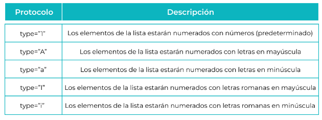
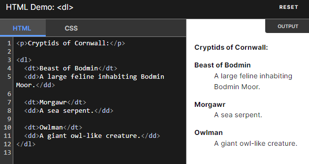
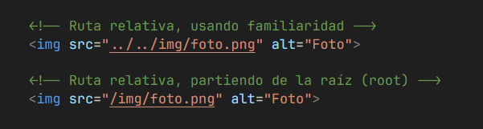
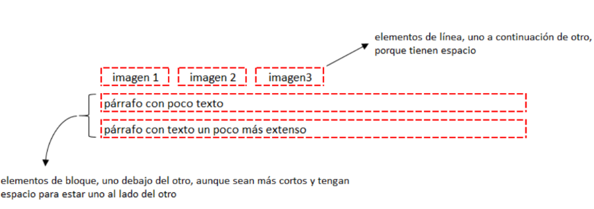

## UNIDAD 4 - Maquetación y marcado HTML

1. [Conceptos básicos I](#1-conceptos-básicos-i)

2. [Conceptos básicos II](#2-conceptos-básicos-ii)

3. [Elementos: Listados en HTML5](#3-elementos-listados-en-html5)

4. [Elementos: Tablas en HTML5]

5. [Elementos: Enlaces en HTML5]

6. [Elementos: Imágenes]

7. [Creación y gestión de formularios]

---

## 1. Conceptos básicos I

[video](#https://www.youtube.com/watch?v=cqMfPS8jPys&t=16s)

### 1.1 ¿Qué es y cómo funciona HTML?

No es un lenuaje de programacion, sino un lenguaje de marcado. HTML nos permite crear estructura Y realizar acciones específicas en la página web.

HTML son las siglas de Hyper Text Markup Language.

Otros nombres que podemos escuchar:

- XHTML- tambien es lo mismo que HTML
- HTML5- Version numero 5- implementa nuevas cosas pero es practicamente igual que html

### 1.2 ¿Cómo definir una etiqueta?

- Etiqyeras de solo apertura(simples): No disponen de cierre, son en su naturaleza el propio contenido, tienen el cierre incrustado en la misma etiqueta de apertura.

        Apertura <nombreEtiqueta>

- Etiquetas de apertura y cierre(dobles): Acogen el contenido entre su apertura y cierre.
  Apertura <nombreEtiqueta>
  Cierre </nombreEtiqueta>

### <u>Estructura de una etiqueta HTML</u>

### Atributos:

Se conforman por el nombre y valor de cada atributo en formato nombre="valor" , se sitúan en la apertura de la etiqueta sin un orden particular y le aportan información y/o configuraciones necesarias:

        
Soy un párrafo.

#### <u> Atributos globales:</u>

Comunes a todas las etiquetas HTML; pueden usarse en cualquier elemento ( id , class...). [Mas info aqui](#https://developer.mozilla.org/en-US/docs/Web/HTML/Global_attributes)

#### <u> Atributos propios:</u>

Deben estar presentes cada vez que se haga uso de su etiqueta y suponen información esencial para su funcionamiento o identificación ( src , href...).

### Contenido:

En aquellas etiquetas que marcan contenido, este debe su naturaleza a la etiqueta que lo acoge:

        <h1>Soy un título.</h1>

### 1.3 ¿Cómo se comenta?

Los comentarios son líneas de texto que nunca entrarán en ejecución.

<!-- Soy un comentario! No produzco ningún cambio visible en la página -->

### 1.4 Estructura básica de un sitio web

---

## 2. Conceptos básicos II

### 2.1 ¿Cómo crear un documento HTML?

Con un editor de texto, creando un archivo.html

        index.html

### 2.2 Contenido estructural y contenido semántico

Cuando se trabajaba con HTML4 o XHTML la estructura de un documento se conseguía mediante capas div y elementos de cabecera h1 a h6. Dependiendo de la anidación que utilizásemos con las cabeceras y capas, así se estructuraba nuestro documento.

        

            <h2>Titulo de la seccion</h2>
            

                <h3>Titulo del articulo</h3>
                
Contenido del articulo

            

        

#### <u>Inconvenientes de usar ese tipo de estructura con HTML4 o XHTML</u>

- El primero es que la semántica del documento no depende de los elementos del documento HTML sino del correcto uso de los estilos CSS. Y hay que recordar que el uso de CSS solo debería de ser para dar estilo al documento.

- Otro problema era la unión de varios documentos HTML, es decir, unir capas div sobre otras capas div. Además, cada una podría tener títulos de cabecera diversos dando como resultado un documento con una estructura incorrecta.

- La interpretación de los documentos en HTML era totalmente lineal, y nos encontrábamos que dentro de una sección podían aparecer partes no relativas a dicho contenido, normalmente elementos como publicidad o información anexa.

- El último inconveniente es que aparecen otros elementos dentro del documento HTML que no son puro contenido, a lo cual también debemos de dar una estructura. Por ejemplo, áreas de navegación, cabeceras y pies de página.

<ad><u>NOTA:</u> Para resolver los problemas derivados de la semántica en HTML4 se crean un conjunto de nuevos elementos en HTML5: article, section, nav, aside, header y footer.</ad>

### 2.3 Modelo semántico de HTML

La semántica en el HTML y HTML5 se refiere al significado o información extra que otorgan los elementos o etiquetas del lenguaje, información que define o describe el contenido, función o sección que contienen. Esta información es lo que permite que un documento se pueda rastrear de mejor manera.

Es importante utilizar los elementos HTML5 de forma correcta para que la página web sea accesible y funcione correctamente. Los elementos funcionales tienen una función específica en la página web, mientras que los elementos no funcionales se utilizan para organizar el contenido de la página web.

Algunos elementos no funcionales pueden interactuar con el usuario de forma especial.

#### <u>Elementos fundamentales:</u>

Los elementos funcionales tienen una función específica en la página web, como reproducir un vídeo, enviar datos o crear un enlace.

`<video src=""></video>`: Permite insertar un vídeo en la página web. Existen 3 formatos de video están soportados por la etiqueta `<video>`: MP4, WebM, y Ogg.

`<audio src=""></audio>`: Permite insertar un audio en la página web. Los formatos de archivos soportados por la etiqueta <audio> son: MP3, WAV y Ogg.

`<form> </form>`: Permite crear un formulario para que los usuarios puedan enviar datos.

<input value="input">: Permite crear un campo de entrada de datos dentro de un formulario.

<button> Button</button>: Permite crear un botón que puede realizar una acción al ser pulsado.

`<canvas></canvas>`: Permite crear gráficos y animaciones de forma dinámica utilizando JavaScript.

`<a href="hypervinculo" title="este mensaje aparecerá como un tooltip saldra al pasar el boton por encima del hyperlink">`: Permite crear un hipervínculo a otra página web o a un recurso dentro de la misma página.

- `<a href="#IDNombre">` podemos redirigir en la misma pagina a otra etiqueta previamente asignada con un id="nombreQueQueramos".
- `<a hrel="mailto:elemail@elquesea.com">` te hará que se te abra el email para mandarlo directamente al email escrito.

- Mas atributos para <a> [aqui](#https://developer.mozilla.org/es/docs/Web/HTML/Element/a)

#### Elementos no funcionales

Los elementos no funcionales no tienen una función específica y se utilizan para organizar el contenido de la página web.

`<body></body>`: Define el cuerpo de la página web, donde se coloca todo el contenido. [Mas info de atributos de body aqui](#https://developer.mozilla.org/es/docs/Web/HTML/Element/body)

`<header></header>`: Define la cabecera de una sección o de la página web (títulos y encabezados). [Mas infor aqui](#https://developer.mozilla.org/es/docs/Web/HTML/Element/header)

`<footer></footer>`: Define el pie de página de una sección o de la página web (derechos de autoría, enlaces legislativos o extensiones de la información). [Mas info aqui](#https://developer.mozilla.org/es/docs/Web/HTML/Element/footer)

`<article></article>`: Define un artículo independiente dentro de una página web, que podría existir independientemente del resto del contenido. [Mas info aqui](#https://developer.mozilla.org/es/docs/Web/HTML/Element/article)

`<section></section>`: Define una sección dentro de una página web. [Mas info aqui](#https://developer.mozilla.org/es/docs/Web/HTML/Element/section)

`<nav></nav>`: Define un área de navegación dentro de una página web. [Mas info aqui](#https://developer.mozilla.org/es/docs/Web/HTML/Element/nav)

`<aside></aside>`: Define un contenido secundario dentro de una página web. [Mas info aqui](#https://developer.mozilla.org/es/docs/Web/HTML/Element/aside)

`<figure></figure>`: Define un contenido independiente, a menudo con un título. Es muy utilizado para describir imágenes, video, ilustraciones, diagramas, fragmentos de código, etc. [Mas info aqui](#https://developer.mozilla.org/es/docs/Web/HTML/Element/figure)

`<figcaption></figcaption>`: Define un subtítulo o leyenda asociado al contenido del elemento padre `<figure>` pudiendo ser colocado como primer o último hijo. Es importante destacar que el elemento `<figcaption>` es opcional. [Mas info aqui](#https://developer.mozilla.org/es/docs/Web/HTML/Element/figcaption)

### 2.4 ¿Cómo se estructura semánticamente en HTML5?

La primera sección dentro de un documento HTML es el propio elemento body .

        <body>
        (Todo el contenido dentro del elemento body es el contenido visible en una web)
        </body>

Dentro del elemento body podremos ver las zonas transversales de la web.

        <header></header>
        <main></main>
        <footer></footer>

Para el resto del contenido se encuentra main y dentro de dicha etiqueta encontraremos diferentes estructuras que nos definirán el resto del contenido.

        <main>
            <section></section>
            <article></article>
            <nav></nav>
            <aside></aside>
        </main>

No debemos olvidar que estructuralmente todos estos elementos son bloque div, pero que tienen una estructura semántica que ayuda a la correcta indexación del contenido

    <header>
        <nav>
            <ul>
                <li><a href="#">Enlace 1</a></li>
                <li><a href="#">Enlace 2</a></li>
                <li><a href="#">Enlace 3</a></li>
            <ul>
        <nav>
    </header>

    <main>
        <h1>Titulo de la página</h1>

        <section>
            <h2>Titulo de la selección</h2>
            <article>
                <h3>título del artículo 1</h3>
                
contenido del artículo 1

            </article>
            <article>
                <h3>título del artículo 2</h3>
                
contenido del artículo 2

            </article>
        </section>

        <aside>
            
barra lateral

        </aside>
    </main>

    <footer>
        
 aviso de privacidad 

    </footer>

las etiquetas de HTML permite incluir otras etiquetas que también añaden información extra, pero además de permitir que el navegador las renderice de manera especial añaden un valor extra que los lectores de pantalla (usados fundamentalmente por personas con problemas de visión) pueden interpretar.
Por eso, en igualdad de condiciones, es recomendable su uso por encima de los elementos identificados con anterioridad, para aumentar el espectro de usuarios que pueden entender correctamente el sitio.

### 2.5 Otras etiquetas de contenido semántico

#### <u>strong y em</u>

Las etiquetas `<strong>` y `<em>` son herramientas esenciales para dar énfasis a palabras o frases dentro de un texto web. A pesar de ser similares en su objetivo, cada una tiene un propósito específico que las diferencia.

<strong>`<strong></strong>` Indica que el texto contenido dentro de esta etiqueta tiene una mayor importancia. Por defecto los navegadores mostrarán esta información en negrita.</strong>

<em> `<em></em>`Enfatiza el contenido dentro de esta etiqueta. Por defecto los navegadores mostrarán esta información en itálica.</em>

#### <u>Citas</u>

Existen dos elementos que permiten identificar citas.

`<blockquote></blockquote>`<blockquote> Se usa para citas largas, es importante fijarse en que la etiqueta 
 se sigue usando dentro del elemento. Los navegadores suelen mostrar este contenido indentado, pero no debemos usar esta etiqueta para ello. Para eso existe el CSS.</blockquote>

`<cite></cite>` <cite>Se usa cuando se quiere referenciar un trabajo (un libro, película, estudio...). En HTML5 no debe usarse para citar a personas, aunque en HTML4 si se permitía.</cite>

#### <u>Abreviaturas</u>

`<abbr></abbr>` Se usa para abreviaturas y acrónimos. Se le añade siempre el atributo “title” especificando el término completo de la abreviatura.

    <abbr title="Search Engine Optimisation"> SEO </abbr> was one of the major thing in Internet Marketing.

#### <u>Referencias y definiciones</u>

`<dfn></dfn>` <dfn>Se usa la primera vez que se explica una nueva terminología. Algunos navegadores muestran esta información en itálica.</dfn>

#### <u>Detalles sobre el autor</u>

`<address></address>`<address>Muestra información relativa al autor, aunque no necesariamente una dirección, puede ser un email, un número de teléfono... Muchos navegadores muestran esta información en itálica.</address >

#### <u>Cambios en el contenido</u>

`<ins></ins>` <ins>Indica que un contenido ha sido insertado a posteriori en un documento.</ins>

`<del></del>` <del> Indica que ha sido eliminado. Se mostrara tachado.</del>

`<s></s>` <s> Indica que una determinada información ya no es relevante o correcta.</s> <ad>Advertencia: DESAPROBADO </ad>

[Ver video explicativo](#https://www.youtube.com/watch?v=eCV_-IHs5xQ&t=7s)

 

### Etiqueta `<!DOCTYPE html>`

Para abrir la etiqueta para crear una pagina con html

### Etiqueta `<html lang="en">`

Para que salga la opcion de cambiar el idioma en las paginas

### Metadatos

#### <u>Dentro de la etiquetas <head></u>

[Página w3schools.com/metadatos](#https://www.w3schools.com/tags/tag_meta.asp)

`<meta charset="UTF-8">` Configura los caracteres de una pagina, como por ejemplo las ñ o acentos.

`<meta name="author" content=" Alba">` Va el autor de la pagina. No es muy usado pero recomendable ponerlo.

`<meta name="description" content=" Maximo de 150 a 170 caracteres con palabras que describan tu pagina."/>` Para que al buscar en google alguan palabra clave referida a tu pagina gracias al contenido que le hayas metido.

    Atajo teclado meta:desc

`<meta name="keywords" content="palabras clave, otra palabra clave, etc">` Para que se encuentre tu pagina por ciertas palabras claves que tu metas, como anteriormente en `<meta name="description">` pero solo con palabras, no con descripcion.

<ad> Este meta dato ya no es aceptado por Google, no lo toma en cuenta como antes, se puede añadir para subir posicionamintos en otro tipo de browser </ad>

`<link rel="stylesheet" type="text/css" href="style.css">` Para linkear css

`` Para linkear javaScript

`<link rel="shortcut icon" type="image/x-icon" href="favicon.ico">` Para agregar favicon (el icono que se ve en la pestañita de la pagina)

## 3. Elementos: Listados en HTML5

[video](#https://www.youtube.com/watch?v=IRbEXqBBOCo&t=1s)

### 3.1 Listas desordenadas

<ul>
    <li>unordered list </li>
    <li>unordered list </li>
    <li>unordered list </li>
</ul>

    <ul>
        <li>unordered list </li>
        <li>unordered list </li>
        <li>unordered list </li>
    </ul>

### 3.2 Listas ordenadas

<ol>
    <li>ordered list </li>
    <li>ordered list </li>
    <li>ordered list </li>
</ol>

    <ol>
        <li>ordered list </li>
        <li>ordered list </li>
        <li>ordered list </li>
    </ol>

#### El atributo type

### 3.3 Listas de descripción HTML

`<dl>` (description list) define la lista de descripción.

`<dt>` (data term) define el término (nombre).`</dt>`

`<dd>` (data definition) describe cada término.`</dd>`

`</dl>`

### 3.4 Listas anidadas

Son listas dento de listas.

    <ol>
        <li>Cafe</li>
        <li>Te
            <ol>
                <li>Black tea</li>
                <li>Green tea</li>
            </ol>
        </li>
        <li>leche</li>
    </ol>

<ol>
    <li>Cafe</li>
    <li>Te
        <ol>
            <li>Black tea</li>
            <li>Green tea</li>
        </ol>
    </li>
    <li>leche</li>
</ol>

## 4. Elementos: Tablas en HTML5

[video-Tablas](#https://www.youtube.com/watch?v=LmSUS6MuSzk&t=3s)

Unicamente se usan para mostrar datos, no para estructurar una página

    <table> Declarar la creacion de una tabla y el inicio.
        <tr> (table row) Indica el número de filas que la conforman.
            <td>Celda 1</td> (table data) Meteremos los datos de una fila.
            <td>Celda 2</td>
            <td>Celda 3</td>
        </tr>
        <tr>
            <td>Celda 4</td>
            <td>Celda 5</td>
            <td>Celda 6</td>
        </tr>
    </table>

Se mostrará así:

<table> 
    <tr> 
        <td>Celda 1</td>
        <td>Celda 2</td>
        <td>Celda 3</td>
    </tr>
     <tr> 
        <td>Celda 4</td>
        <td>Celda 5</td>
        <td>Celda 6</td>
    </tr>
</table>

 
 

    <table>
        <tr> (table row)
            <th>Nombre</th>(table heading) Añadir un encabezado a las columnas.
            <th>Apellido</th>
            <th>Edad</th>
        </tr>
        <tr>
            <td>Juan</td> (table data)
            <td>Perez</td>
            <td>39</td>
        </tr>
    </table>

Se mostrará así:

<table>
    <tr>
        <th>Nombre</th>
        <th>Apellido</th>
        <th>Edad</th>
    </tr>
    <tr>
        <td>Juan</td>
        <td>Perez</td>
        <td>39</td>
    </tr>
</table>

### 4.1 Ancho, espaciado, borde y color de fondo

Ya se ha comentado que el estilo y la estructura de una web deben crearse usando CSS, y limitar el HTML a la creación del contenido. Aún así es posible definir 5 valores usando HTML:

- Atributo “width”: Ancho de la tabla, así como de las filas.

- Atributo “cellpadding”: Espaciado dentro de una celda.

- Atributo “cellspacing”: Espaciado entre celdas.

- Atributo “border”: Borde entre las celdas.

### 4.2 Tablas largas: cabecera, cuerpo y pie de tabla

Para completar todo lo dicho sobre las tablas hay 3 etiquetas más que debes conocer y que aportan un grado más de semántica, estas son:

`<thead>` Funciona como un `<tr>`, pero declara aquellas fila donde se vaya a alojar el/los titular/es de la tabla, por tanto, en su interior deberíamos incluir solo `<th>` .

`<tbody>` Funciona como un `<tr>`, pero declara aquella/s fila/s donde se vaya/n a alojar el/los contenidos de la tabla, por tanto, en su interior deberían mostrarse `<td>` (o `<th>` de haber titulares para una determinada fila).

- `<tfooter>` Funciona como un `<tr>`, pero declara aquella fila donde se vaya/n a alojar el/los contenido/s del pie de la tabla, por tanto, en su interior deberían mostrarse `<td>` (o `<th>` de haber titulares para una determinada fila).

        <table width="100%" border="1">
            <thead>
                <th>Nombre</th>
                <th>Apellido</th>
                <th>Edad</th>ta
            </thead>
            <tbody>
                <tr>
                    <td>Juan</td>
                    <td>Perez</td>
                    <td>38</td>
                </tr>
                <tr>
                    <td>Pepe</td>
                    <td>Lopez</td>
                    <td>28</td>
                </tr>
                <tr>
                    <td>Lucia</td>
                    <td>Pombo</td>
                    <td>30</td>
                </tr>
            </tbody>
            <tfoot>
                <th>Nombre</th>
                <th>Apellido</th>
                <th>Edad</th>
            </tfoot>
        </table>

<table width="100%" border="1">
    <thead>
        <th>Nombre</th>
        <th>Apellido</th>
        <th>Edad</th>
    </thead>
    <tbody>
        <tr>
            <td>Juan</td>
            <td>Perez</td>
            <td>38</td>
        </tr>
        <tr>
            <td>Pepe</td>
            <td>Lopez</td>
            <td>28</td>
        </tr>
        <tr>
            <td>Lucia</td>
            <td>Pombo</td>
            <td>30</td>
        </tr>
    </tbody>
    <tfoot>
        <th>Nombre</th>
        <th>Apellido</th>
        <th>Edad</th>
    </tfoot>
</table>

### 4.3 Expandir columnas

En ocasiones, es posible que se desee que cierta información ocupe más de una columna. Para ello existe el atributo “colspan” que funciona así:

    <table style="width=100%">
        <tr>
            <th>Name</th>
            <th colspan="2">Telephone</th>
            <th>Ciudad</th>
        </tr>
        <tr>
            <td>Bill Gates</td>
            <td>55577854</td>
            <td>55577855</td>
            <td>Murcia</td>
        </tr>
    </table>

<table style="width=100%">
    <tr>
        <th>Name</th>
        <th colspan="2">Telephone</th>
        <th>Ciudad</th>
    </tr>
    <tr>
        <td>Bill Gates</td>
        <td>55577854</td>
        <td>55577855</td>
        <td>Murcia</td>
    </tr>
</table>

El número que aparece como valor indica el número de columnas que ocupará la etiqueta.

Cuando se utiliza este atributo no se deben escribir en el código aquellas celdas que no se vayan a pintar, como sí ocurría en el ejemplo anterior. El atributo se puede aplicar tanto a `<td>` como a `<th>.`

### 4.4 Expandir filas

También es posible reproducir el mismo efecto, pero en filas en vez de en columnas utilizando el atributo “rowspan”. El atributo se puede aplicar tanto a `<td>` como a `<th>`.

    <table style="width=100%">
        <tr>
            <th>Name:</th>
            <td>Bill Gates</td>
        </tr>
        <tr>
            <th rowspan="2">Telephone</th>
            <td>55577854</td>
        </tr>
        <tr>
            <td>55577855</td>
        </tr>
    </table>

<table style="width=100%">
    <tr>
        <th>Name:</th>
        <td>Bill Gates</td>
    </tr>
    <tr>
        <th rowspan="2">Telephone</th>
        <td>55577854</td>
    </tr>
    <tr>
        <td>55577855</td>
    </tr>
</table>

## 5. Elementos: Enlaces en HTML5

Existen 5 tipos de links o enlaces:

- Links de una web a otra: Son aquellos que permiten lo que comúnmente se conoce como “navegar” por la web.

- Links de una página a otra de una misma web.

- Links desde una parte de una sección a otra parte de la misma sección. Comúnmente llamados “anclas”.

- Links que abren una nueva ventana/pestaña del navegador.

- Links que permiten abrir el cliente de correo por defecto del SO y preparar un email para su envío o realizar una llamada de teléfono desde el ordenador o dispositivo móvil.

- La etiqueta designada para definir un email es la `<a>`, el sistema funciona de la siguiente manera: Primero se define el link con el tag `<a>`, dentro del mismo se escribe el texto que se quiera utilizar para permitir hacer clic en él y generar un enlace. A su vez dicho enlace se define dentro de la apertura de la etiqueta con el atributo href.

        <a href="http://www.google.com">Ir a Google</a>

  <a href="http://www.google.com">Ir a Google</a>

 

Hay que tener en cuenta que un usuario tiende a escanear las webs por las que navega y ya ha aprendido a buscar enlaces o botones como manera rápida de ir de un punto a otro, por eso a los elementos más predominantes de la interfaz se les denomina <u>CTAs (Call To Action)</u>, ya que serán lo que primero llame la atención. Es recomendable por tanto seguir una serie de pautas a la hora de crear el texto del enlace, para así facilitar su comprensión:

- El texto debe explicar claramente la acción que se va a realizar al clicar en él, por ejemplo, si va a redirigir a una web indicarlo con algo como “Ir a la web X”.

- El texto debería ser (o comenzar por) un verbo, ya que estos denotan acciones, aunque pueden darse excepciones es raro que esto ocurra.

- El texto debe ser breve. A ser posible debería componerse de una única palabra, si esto es imposible lo ideal es reducirlo al mínimo obligatorio para su comprensión.

- Añadido a esto, de un tiempo a esta parte la tendencia es dejar de lado el denominado “lenguaje máquina”, en favor del “lenguaje humano”. Este último se caracteriza por dejar de lado los verbos sin declinar y usar la primera o segunda persona del singular, también se trata de la idea de establecer una conversación entre “yo” (la empresa) y “tú” (el usuario). Se muestran algunos ejemplos:

        “Regístrate” frente a “Registrar”

        “Continúa leyendo” frente a “Saber más”

        “Busca” frente a “Buscar”

[Video enlaces HTML](#https://www.youtube.com/watch?v=RdnS55MbdY4)

### [5.1 Links de una web a otra](#53-links-para-generar-un-email-o-teléfono)

Se generan con la etiqueta `<a>`, un texto usado a modo de área donde hacer clic y una URL dentro del atributo href. Esta será lo que se conoce como una URL (Universal Resource Locator) absoluta.

Añadimos el atributo target="\_blank" para que se abra en otra pagina.

        Por ejemplo:
        <a href="https://webdesign.tutsplus.com/c/htmlcss/s/html" target ="_blank">

### 5.2 Links de una sección a otra de una misma web

La etiqueta `<a>` en este caso apunta a lo que se conoce como una URL relativa.
Estas no necesitan que se especifique el dominio, aunque esto lleva asociada la necesidad de definir una estructura del sitio. Para ello, es necesario entender que un directorio no deja de ser más que un espacio en un disco duro de un ordenador (servidor) en alguna parte del mundo. Éste se organiza (al igual que nuestro ordenador) con un sistema de carpetas que debería seguir una estructura similar a esta:

- <strong> Archivo inicial: <u>index.html</u> </strong> (la sección principal de una web, generalmente la Home, siempre ha de nombrarse así, ya que los navegadores están “entrenados” para buscarla primero.)

- <strong>Carpeta con contenido HTML:</strong> para cada sección de nuestra web (about us, contacto, etc) crearemos un archivo con el nombre de la sección, o una carpeta con el nombre de la sección que contenga un index.html.

- <strong>Carpeta con las imágenes del proyecto:</strong> Subcarpetas con las imágenes ordenadas como corresponda.

        (nombre de carpeta: src recomendable)

- <strong>Carpeta con las hojas de estilo CSS</strong>

        <link rel="stylesheet" type="text/css" href="style.css">

- <strong>Carpeta con los archivos de código JavaScript</strong>

        

- <strong> Para agregar favicon </strong>(el icono que se ve en la pestañita de la pagina)

        <link rel="shortcut icon" type="image/x-icon"nhref="favicon.ico">

Existe una nomenclatura para definir esta estructura. A la carpeta contenedora del proyecto se la considera la raíz, o root folder. A su vez se genera una estructura “familiar” entre carpetas. Por ejemplo cada carpeta contenedora de otra es considerada parent (o padre) de esta (que, a su vez, es considerada child (o hijo) de la carpeta parent), carpetas al mismo nivel serían siblings, y carpetas con más de un nivel de separación serían grandchild.

Toda esta estructura familiar supone la necesidad de entender cómo crear un link para cada una de estas situaciones:

#### Siblings

Archivos al mismo nivel: Sólo es necesario el nombre del archivo:

        <a href="./archivo.html">Archivo</a>

        <a href="archivo.html">Archivo</a>

#### Children

Archivos un nivel por debajo: Es necesario el nombre de la carpeta contenedora y del nombre del archivo:

        <a href="carpeta/archivo.html">Archivo</a>

#### Grandchild

Archivos dos niveles por debajo: Es necesario el nombre de la carpeta contenedora, de la subcarpeta, y del nombre del archivo:

        <a href="carpeta/subcarpeta/archivo.html">Archivo</a>

#### Parent

Archivos un nivel por encima: Es necesario escribir ../ y del nombre del archivo:

        <a href="../archivo.html">Archivo</a>

#### Grandparent

Archivos dos niveles por encima: Es necesario escribir ../ tantas veces como niveles por encima haya, y del nombre del archivo:

        <a href="../../archivo.html">Archivo</a>

Además de esta manera de apuntar a diferentes archivos, también se puede usar una manera un poco más “absoluta”, pero aún así relativa: podemos empezar la ruta con`“/”`, que empezará desde el root. Esta nomenclatura nos permite llamar a un archivo estemos donde estemos.

De esta manera, si estamos en la carpeta `/contacto/llamanos/index.html` y queremos poner una foto que se encuentra en /img/foto.png, podemos escribir el código de las siguientes maneras:

La segunda manera permite mover el archivo `index.html` a cualquier lugar sin peligro de dejar de apuntar correctamente al archivo deseado.

 

### 5.3 Links para generar un email o teléfono

Para crear un enlace que permita abrir automáticamente el gestor de correo predefinido del SO basta con añadir el texto mailto: dentro del atributo href, así:

        <a href="mailto:nombre@email.com">Nombre</a>

Es recomendable que, de ser un enlace y no un botón, el texto que permitirá hacer clic para generar el link indique la dirección a la que se va a escribir.

De este modo aquellos usuarios que no tengan configurado un cliente de correo de escritorio (la mayoría) podrán conocer la dirección de email a la que dirigirse.

Si por el contrario lo que se busca es realizar un link a un número de teléfono para que cuando la web se visualice en un teléfono móvil lance la aplicación de llamada nativa el enlace sería de la siguiente forma:

    <a href="tel:915425875">915425875</a>

### 5.4 Links que abren una nueva ventana/pestaña

Sencillamente es necesario introducir el atributo target=”\_blank” asociado a la etiqueta `<a>`, así:

    <a href="http://www.google.com" target="_blank">Ir a Google</a>

Este tipo de enlace se usa cuando se desea enlazar con una web externa, ya que lo deseable es que después el usuario vuelva a navegar por nuestro sitio. Está considerada una “buena práctica” el advertir a nuestros usuarios de ello en el texto del enlace.

### 5.5 Links de una parte de una sección a otra de la misma

Este tipo de enlaces son útiles cuando el contenido de una sección es especialmente largo, ya que permiten al usuario dirigirse de un punto a otro de la misma más rápida y cómodamente que haciendo scroll.

Para poder crear este tipo de enlace primero es necesario, por un lado, introducir un atributo id dentro de la etiqueta que queramos enlazar, y por otro lado, incluir el carácter “#” delante del nombre del id de la sección al que queramos enlazar dentro del atributo href, así:

    Enlace <a href="#nombreid">Parte</a>
    Sección enlazada. <h1 id="nombreid">Parte</a>

Estos ids deben empezar siempre por una letra o una línea.

### 5.6 Links de una sección a una parte de otra

Si queremos llevar al usuario a una parte de nuestra web específica, podemos combinar los métodos explicados anteriormente: le llevamos a una página distinta, sea con ruta absoluta o relativa (absoluta: `http://www.otraweb.com/contacto`, relativa: `contacto.html`), y le llevamos a una sección específica con el `id (#parte, #form)`:

    <a href="http://www.otraweb.com/contacto#parte> Ir a una parte de otra web</a>
    <a href="contacto.html#form"> Ir a una parte de otra sección de mi web</a>

 
 

## 6. Elementos: Imágenes

### 6.1 Pautas previas

Es recomendable seguir unas pautas previas a la inclusión de las imágenes en una web:

1. Crear una carpeta contenedora para todas las imágenes.

2. Si tenemos muchas imágenes, es recomendable subdividir esta carpeta en subcarpetas para su organización.

3. Utilizar las minúsculas para la nomenclatura. De hecho, esto se aplica también a cualquier otro documento que se vaya a incluir en una web (tipografías, archivos html, video...).

4. Los espacios entre palabras pueden generarse utilizando el carácter guión medio, o guión inferior.

Las imágenes no están contenidas como tal dentro del html, sino que existe una etiqueta “simple” (es decir, que no requiere de cierre independiente) que permite enlazarlas, la etiqueta `` , que a su vez requiere de un atributo `src = " nombre ruta relativa o absoluta"` para indicar la dirección de almacenamiento de la imagen, así:

    

Asociados a esta etiqueta existen una serie de atributos que permiten añadir información adicional:

`alt` - Añade una descripción de la imagen en el caso de que no puedas verla, está pensado para personas con problemas de visión y motores de búsqueda, es recomendable incluirlo siempre.

`title` - Añade información adicional de la imagen, la mayoría de los navegadores muestran esta información como un tooltip.

[Video-Imagenes](#https://www.youtube.com/watch?v=lAoeALwWKo0)

 

### 6.2 Trabajar con imágenes

Es importante manejar 3 reglas a la hora de crear imágenes para la web:

    - Usar el formato adecuado.
    - Usar el tamaño correcto.
    - Trabajar siempre en píxeles.

#### Formatos

Existen multitud de formatos de imagen, pero en la web se trabaja fundamentalmente con los siguientes:

`Formato JPEG`: Para imágenes fotográficas o aquellas imágenes que requieran de mucha información de color.

`Formato PNG`: Para imágenes con colores planos o poca información de color. También para aquellas imágenes que requieran del uso de transparencias y semitransparencias.

`Formato GIF`: Para imágenes con poca información de color o animaciones. También para imágenes que tengan píxeles o bien 100% opacos, o bien 100% transparentes.

`Formato vectorial o svg (Scalable Vector Graphic)` permite hacer la imagen independiente de la resolución para así poder cubrir cualquier pantalla, independientemente de su resolución. Por su propia idiosincrasia están reservados a la iconografía o imágenes con muy poca información de color (cuando no colores planos directamente). Su uso aún no está demasiado extendido, así que es necesario testear su compatibilidad con los diferentes navegadores (y sus versiones).

#### Añadir subtítulos

HTML 5 introdujo la posibilidad de añadir un subtítulo a una o varias imágenes, si así se desea. Para ello, es necesario introducir dos nuevas etiquetas asociadas al tag ``:

`<figure>` - Esta etiqueta rodea tanto al tag `` como al tag `<figcaption>` que permite añadir el subtítulo. Es posible introducir tantas imágenes como se quiera dentro de esta etiqueta, pero tan solo un subtítulo.

`<figcaption>` - Esta etiqueta es la que lleva asociado el subtítulo de la/s imagen/es.

    <figure>
    
    <figcaption>Perrito feliz</figcaption>
    </figure>

De este modo el código quedaría así:

<figure>
    
    <figcaption>Perrito feliz</figcaption>
</figure>

Lo bueno es que los navegadores antiguos, aunque no reconozcan las etiquetas, simplemente las ignoran, y muestran el contenido de las mismas.

### 6.3 Elementos HTML en bloque y en línea

Básicamente, cuando maquetamos en html construimos “cajas” y dentro de éstas ponemos el contenido. Estas “cajas” son lo que conocemos como elementos de tipo bloque. Dependiendo de la etiqueta que hayamos usado para crear un bloque, tendrá un significado u otro para el navegador. No es lo mismo usar un div (divisor) que un h1 (título), pero en cierto modo, y estrictamente en términos de maquetación, ambas etiquetas crean una caja.

Debemos entender que los bloques jamás van a permitir que haya nada a su lado. Aunque haya espacio. Nunca podremos colocar nada junto a un elemento en bloque. Por ello, en una web sin formato todos los elementos se ordenan de forma vertical. Los elementos en bloque crean saltos de línea y esto es debido a que siempre ocuparán el 100% del ancho. Si le dices a un bloque que ocupe un ancho determinado en píxeles (por ejemplo, width: 200px) dará lo mismo: creará un margen a su lado que impedirá que cualquier elemento se ponga junto a él.

`<h1>, <h2>, <h3>, 
, <ul>, <li>, 
, <header>, <nav>, <section>, <article>, <footer>, <form>, <table>`

Por otro lado, tenemos los elementos en línea. Si los elementos en bloque eran el contenedor, debemos tratar a los elementos en línea como contenido. De la misma forma que una letra se coloca al lado de otra cuando escribimos un texto, cuando colocamos un elemento en línea junto a otro se colocará a su lado siempre que el ancho de pantalla lo permita. Podemos tratar a los elementos en línea como si fuera texto. No están pensados para ser contenedores, sino que son contenidos por ellos mismos. Así, un elemento en línea sólo ocupa lo estrictamente necesario, no el 100% como sí ocurre con los bloques.

Una etiqueta de línea es aquella que ocupa el espacio mínimo necesario en horizontal, y permite que otro elemento se coloque a su lado.

`<a>, , <strong>, , <input>, <code>`

Debemos entender las diferencias entre ambos elementos para poder crear nuestras estructuras con css. No podemos tratar por igual a un elemento en bloque y en línea, es uno de los errores más comunes cuando se comienza a maquetar.

 

<ad>¡Importante!</ad>

Uno de los puntos más polémicos a la hora de trabajar con elementos es que no podemos usarlos de la misma forma. Por lo general un elemento en bloque puede contener varios elementos en bloque y elementos en línea, pero un elemento en línea no puede contener otro elemento en bloque.

Un elemento en línea no puede contener un elemento en bloque, un elemento en bloque puede contener otros bloques o elementos en línea.

 
 

## 7.1 Elementos de un formulario web

Se dividen en 4 grupos fundamentales:

- Campos de búsqueda
- Escribir texto
- Texto (en una sola línea)
- Contraseñas
- Texto (en múltiples líneas)
- Email / URL
- Elegir entre varias opciones
- Radio buttons: Para elegir una entre varias opciones
- Checkboxes: Para elegir varias opciones simultáneamente
- Drop-downs: Para elegir una entre varias opciones de una lista larga.
- Enviar formularios:

        - GET lleva los datos de forma "visible" al cliente (navegador web). El medio de envío es la URL. Los datos los puede ver cualquiera.
        - POST consiste en datos "ocultos" (porque el cliente no los ve) enviados por un formulario cuyo método de envío es post.

- Subir archivos
- Botones por imagen
- Botones

### Estructura de un formulario:

        <form action="resultado.html" method="GET">

            <label for="nombre">Nombre</label>
            <input type="text" id="nombre" name="nombrecito" value="Pepe">
            <label for="edad">Edad</label>
            <input type="text" id="edad" name="edad" placeholder="introduce tu edad numerica">
            <!--submit ejecuta el envio del formulario y me lleva a resultado-->
            <input type="submit" value="Enviar">
        </form>

#### <u>Así se vería:</u>

<form action="resultado.html" method="GET">
<label for="nombre">Nombre</label>
<input type="text" id="nombre" name="nombrecito" value="Pepe">

<label for="edad">Edad</label>
<input type="text" id="edad" name="edad" placeholder="introduce tu edad numerica">

        Submit ejecuta el envio del formulario y me lleva a resultado

<input type="submit" value="Enviar">
</form>

 
 

[Video-Formulario HTML](#https://www.youtube.com/watch?v=QDOfODwsfuQ)

 

La etiqueta que delimita un formulario es la etiqueta `<form> </form>` .

Los atributos más importantes de la etiqueta `<form>` son:

- `action`: Contiene el nombre del agente que procesará los datos remitidos al servidor (por ejemplo, un script de PHP)

- `method`: Define la manera de enviar los datos al servidor. Los valores posibles son:

  - `get`: Los datos del formulario se adjuntan a la URL como parte de la cadena de consulta. Es adecuado para formularios con un número limitado de datos y que no contienen información sensible. Por ejemplo, se usa comúnmente para la búsqueda de páginas.

  - `post`: <strong> Los valores se envían de forma separada y no visible para el usuario.</strong> Los datos del formulario se envían en el cuerpo de la solicitud HTTP. Es más seguro que GET ya que los datos no son visibles en la URL y pueden contener más información y datos confidenciales. Es adecuado para formularios con una gran cantidad de datos o que contienen información sensible, como contraseñas.

 

    Si el atributo method no está establecido, el formulario se comporta como si el valor fuera get.

La etiqueta `<form>` es un elemento de bloque.
En su interior puede haber cualquier elemento típico de una página web (párrafos, imágenes, divisiones, listas, tablas, etc.), además de las etiquetas que crean los controles.

Las etiquetas que crean los controles en los formularios son `<input>, <button>, <select>, <optgroup>, <option>` y `<textarea>` .

Además, se pueden estructurar los controles con las etiquetas `<fieldset>` y `<legend>` .

Ejemplo
`<fieldset>` <fieldset> <input value="botton"></fieldset>

Por último, la etiqueta `<label>` permite mejorar la accesibilidad de los controles.

El navegador envía únicamente los datos de los controles contenidos en el formulario. En una misma página puede haber varios formularios que envíen datos al mismo o a diferentes agentes.

---

## Atributos

### El atributo `type`

El atributo type de la etiqueta `<input>`<input> indica el tipo de control de que se trata.

En HTML 4.01, los tipos de `<input>` eran: botón para enviar `submit`, botón para reiniciar `reset`, texto `text`, contraseña `password`, archivo `file`, imagen `image` y oculto `hidden`.

En HTML 5 se añadieron los tipos de `<input>`: botón `<button>`, número `number`, búsqueda `search`, teléfono `tel`, dirección web `url`, dirección de correo `email`, fecha `date`, hora `time`, color `color` y rango `range`.

En HTML 5.1 se añadieron los tipos de `<input>`: mes `month`, semana `week` y date y hora local `datetime-local`.

---

### El atributo `value`

El atributo `value` permite establecer el valor inicial de un control, aunque cada control lo utiliza de una forma ligeramente distinta y algunos controles no lo admiten (área de texto, archivo o imagen).

En algunos casos (botones) el valor se muestra al usuario y el usuario no puede modificarlo. En otros casos (cajas de texto, contraseña) el valor se muestra en la página y el usuario puede modificarlo. En otros casos (casillas de verificación, botones radio, opciones de menú, oculto) el valor no se muestra en la página y el usuario no puede modificarlo.

En algunos casos (botones, oculto, botones radio) el atributo value es necesario. En otros casos (casilla de verificación, opciones de menú) es conveniente. En otros casos (cajas de texto, contraseña, imagen) puede omitirse. En el caso del selector de archivo, los navegadores no lo admiten por motivos de seguridad.

---

### El atributo `name`

El atributo `name` identifica al control. Todos los controles de un formulario deben tener el atributo name porque, en general, sólo se envían los controles que lo tienen (aunque hay excepciones, como los controles de tipo imagen o los botones, que no los necesitan).

<ad> NOTA: </ad>

En los formularios es necesario que cada etiqueta `label`, `input` que vaya a recoger un dato, tenga el atributo name, para que ese dato se envie, si no lo tiene no se enviará.

Los atributos `name="dato"`<strong> no se deben repetir</strong>, porque no se recibiría toda la información al enviarla. La única excepción es el radiobutton como se explica en el apartado correspondiente.

---

### El atributo `required`

El atributo `required` permite indicar qué controles es obligatorio rellenar para enviar el formulario.

    
Nombre: <input type="text" name="nombre" required>

    
Sexo
        <input type="radio" name="hm" value="h" required> Hombre
        <input type="radio" name="hm" value="m" required> Mujer
    

#### Se verá así:

Nombre: <input type="text" name="nombre" required>

Sexo
<input type="radio" name="hm" value="h" required> Hombre
<input type="radio" name="hm" value="m" required> Mujer

---

### El atributo `placeholder`

El atributo `placeholder` permite mostrar en los controles de texto un texto que desaparece al escribir en el control.

    <input type="text" id="nombre" name="nombrecillo" value="Pepe" placeholder="introduce un nombre">

#### Se verá así:

<input type="text" id="nombre" name="nombrecillo" value="Pepe" placeholder="introduce un nombre">

---

### Los atributos `maxlength` y `minlength`

Los atributos `maxlength` y `minlength` permiten establecer la longitud máxima y mínima, respectivamente, que puede escribir el usuario en un control de texto (text, password, search, etc.).

    <input type="password" name="password" minlength="6">

#### Se verá así:

<input type="password" name="password" minlength="6">

---

### El atributo `disabled`

El atributo `disabled` permite deshabilitar el control. Una vez deshabilitado, el control ni siquiera puede coger el foco.

    <input type="submit" value="Enviar" disabled>

<input type="submit" value="Enviar" disabled>

---

### El atributo `readonly`

El atributo `readonly` hace que el control no sea modificable, aunque el control puede coger el foco.

    <input type="text" name="texto" value="¡A que no me cambias!" readonly>

<input type="text" name="texto" value="¡A que no me cambias!" readonly>

 
 

---

## 7.2 Accesibilidad

La etiqueta `<label>` permite asociar un control con un texto, de manera que mejore la accesibilidad de los formularios. La asociación entre el control y la etiqueta `<label>` puede ser implícita o explícita.

### Relación implícita

Se dice que la relación es implícita cuando el control se encuentra en el interior de la etiqueta.

Por ejemplo, en el caso de una casilla de verificación, la etiqueta `<label>` permite que la casilla se marque o desmarque haciendo clic en el texto, como se muestra en los ejemplos siguientes:

    <label>
    <input type="checkbox" name="casilla">Casilla 1
    </label>

#### Se verá así:

<label>
<input type="checkbox" name="casilla">Casilla 1
</label>

 

En el caso de la cajas de texto input de tipo texto, la etiqueta `<label>` permite que el cursor se sitúe en la caja de texto haciendo clic en el texto, como se muestra en los ejemplos siguientes:

    <label>Nombre:
    <input type="text" name="casilla">
    </label>

#### Se verá así:

<label>Nombre:
<input type="text" name="casilla">
</label>

---

### Relación explícita: el atributo `for`

Se dice que la relación es explícita cuando la etiqueta `<label>` contiene el atributo `for`, que indica el control afectado (el control tiene entonces que tener establecido el atributo `id`).

Por ejemplo, en el caso de una casilla de verificación, la etiqueta `<label>` permite que la casilla se marque o desmarque haciendo clic en el texto, como se muestra en los ejemplos siguientes:

    <input type="checkbox" name="casilla" id="casilla1">
    <label for="casilla1">Casilla 1</label>

<input type="checkbox" name="casilla" id="casilla1">
<label for="casilla1">Casilla 1</label>

---

### 7.3 Controles `<input>`

    Los controles son los elementos que permiten al usuario introducir información. La mayoría de controles se obtienen mediante mediante la etiqueta vacía <input>.

#### Vamos a ver un listado de los más importantes:

`input que admite texto`

    <input type="text" name="nombre" id="nombre">

#### Se verá así:

<input type="text" name="nombre" id="nombre">

 

---

 

`input que admite numeros`

    <input type="number" name="edad" min="0" max="50" step="2">

#### Se verá así:

<input type="number" name="edad" min="0" max="50" step="2">

 

---

 

`boton para ejecutar el formulario`

    <input type="submit" value="Guardar">
    <button>Enviar</button>

#### Se verá así:

<input type="submit" value="Guardar">
<button>Enviar</button>

 

---

 

`input para contraseña`

    <input type="password" name="password"  placeholder="introduce una contraseña">

#### Se verá así:

<input type="password" name="password"  placeholder="introduce una contraseña">

 

---

 

`input para email`

    <input type="email" name="email" placeholder="introduce en email">

#### Se verá así:

<input type="email" name="email" placeholder="introduce en email">

 

---

 

`input para introducir direcciones web`

    <input type="url" name="direccion" size="40">

#### Se verá así:

<input type="url" name="direccion" size="40">

 

---

 

`input para rangos numericos`

    <label>Rango : -20 a 20 </label>
    <input type="range" name="rango" min="-20" max="20">

#### Se verá así:

<label> Rango : -20 a 20 </label>
<input type="range" name="rango" min="-20" max="20">

 

---

 

`input para colores`

    <input type="color" name="color">

#### Se verá así:

<input type="color" name="color">

 

---

 

`input para fecha`

    <input type="date" name="fecha">

#### Se verá así:

<input type="date" name="fecha">

 

---

 

`input para horas o tiempo`

    <label for=""> hora inicio: </label>
    <input type="time" name="horas" value="13:30">

    <label for=""> hora fin: </label>
    <input type="time" name="horas" value="13:30">

#### Se verá así:

<label for=""> hora inicio: </label>
<input type="time" name="horas" value="13:30">

<label for=""> hora fin: </label>
<input type="time" name="horas" value="13:30">

 

---

 

`semanas` <ad> No admitido dolo chrome</ad>

    <input type="week" name="semanas">

#### Se verá así:

<input type="week" name="semanas">

 

---

 

`para enviar archivos adjuntos`

<ad> Es necesario la propiedad de </ad> `form enctype="multipart/form-data"`

    

    <label for="file"> Añadir adjunto: </label>
    <input type="file" id="file" name="file">
    

#### Se verá así:

    <label for="file"> Añadir adjunto: </label>
    <input type="file" id="file" name="file">

 

---

 

## 7.4 Casillas de verificación

Las casillas de verificación se crean mediante una etiqueta `<input>` cuyo atributo `type` tiene el valor checkbox.

Si el atributo `checked` tiene el valor `checked`, la casilla aparece marcada.

Las casillas de verificación sólo se envían si se han marcado. El atributo `value` contiene el valor que envía el formulario si la casilla de verificación está marcada. Si el atributo `value` no está establecido, el formulario envía el valor `on`. Permite hacer estructuras de preguntas multirespuesta.

    <form action="">
        

            <h2>Selecciona las respuestas correctas</h2>
        

        

            <input type="checkbox" name="respuesta1" value="ok"> Pregunta 1
        

        

            <input type="checkbox" name="respuesta2" value="ok"> Pregunta 2
        

        

            <input type="checkbox" name="respuesta3" value="ok"> Pregunta 3
        

        <input type="submit" value="responder">
    </form>

#### Se verá así:

<form action="">
    

        <h2>Selecciona las respuestas correctas</h2>
    

    

        <input type="checkbox" name="respuesta1" value="ok"> Pregunta 1
    

    

        <input type="checkbox" name="respuesta2" value="ok"> Pregunta 2
    

    

        <input type="checkbox" name="respuesta3" value="ok"> Pregunta 3
    

    <input type="submit" value="responder">
</form>

## 7.5 Casillas de respuesta única `RADIOBUTTON`

Los botones `radio` se crean mediante una etiqueta `<input>` cuyo atributo `type` tiene el valor `radio`.

Los botones `radio` que tienen el mismo atributo `name` forman un grupo, es decir, que si se marca uno de ellos se desmarca automáticamente el resto.

Si los atributos `name` no tienen el mismo valor, los botones radio son independientes (al marcar uno no se desmarca el otro).

Los botones `radio` sólo se envían si se han marcado.

El atributo `value` contiene el valor que envía el formulario si el botón `radio` está marcado. Si el atributo `value` no está establecido, el formulario envía el valor `on`, así que para poder saber cuál ha sido la opción elegida por el usuario es necesario establecer con valores distintos los atributos value de todos los elementos de un botón `radio`. Si uno de los botones tiene el atributo `checked` con el valor `checked`, el botón aparece marcado de forma predeterminada.

## 7.6 Menú desplegable `<select>`

Los menús se crean mediante la etiqueta `<select>`. Cada opción del menú se define mediante la etiqueta `<option>` .

El valor que se envía es el texto que aparece en el menú, salvo si el elemento `<option>` contiene el atributo value.

El atributo `selected` indica la opción por omisión. Si ningún elemento posee el atributo `selected`, los navegadores muestran la primera opción del menú.

El problema de mostrar una de las opciones de forma predeterminada es que al recibir el formulario no se puede saber si el usuario ha elegido realmente esa opción o simplemente no ha modificado el control. Por ello, se aconseja incluir una opción en blanco al principio de los menús. El atributo `size` permite definir la altura del control.

El atributo `multiple` permite elegir varias opciones simultáneamente (con ayuda de la tecla <button>Control</button> o <button>Mayúsculas </button>).

En este caso el atributo `name` debe incluir corchetes ([]) para que se puedan enviar en su caso varios valores en forma de matriz.

    <form action="">
    Elige tu ciudad:
    <select name="ciudad" id="ciudad">
        <option value="" selected>Seleccione una ciudad</option>
        <option value="m">Madrid</option>
        <option value="b">Barcelona</option>
        <option value="va">Valladolid</option>
        <option value="v">Valencia</option>
        <option value="cu">Cuenca</option>
        <option value="c">Coruña</option>
    </select>
    <input type="submit" value="Enviar">
    </form>

#### Se verá así:

<form action="">
    Elige tu ciudad:
    <select name="ciudad" id="ciudad"> 
        <option value="" selected>Seleccione una ciudad</option>
        <option value="m">Madrid</option>
        <option value="b">Barcelona</option>
        <option value="va">Valladolid</option>
        <option value="v">Valencia</option>
        <option value="cu">Cuenca</option>
        <option value="c">Coruña</option>
    </select>
    <input type="submit" value="Enviar">
</form>

 

---

 

## 7.7 Área de texto `<textarea>`

Las cajas de texto de varias líneas se crean mediante la etiqueta `<textarea>`. Los atributos obligatorios rows y cols establecen el número de filas y columnas iniciales de la caja, aunque los navegadores permiten modificarlo arrastrando la esquina inferior derecha.

Si se escribe texto en el interior de la etiqueta, este se muestra en la caja de texto. HTML 5 introdujo el atributo `placeholder` que puede ser más cómodo para el usuario si tiene que borrar todo el texto incluido.

    <textarea name="texto" rows="4" cols="20" placeholder="Escriba algo">
    Este texto aparece dentro del textarea si lo quitas se ve el placeholder
    </textarea>

#### Se verá así:

<textarea name="texto" rows="4" cols="20" placeholder="Escriba algo">
    Este texto aparece dentro del textarea si lo quitas se ve el placeholder
</textarea>

## 7.8 Control oculto `<input type="hidden">`

El control oculto se crea mediante una etiqueta `<input>` cuyo atributo `type` tiene el valor `hidden`. Lógicamente, los navegadores no muestran estos controles en la pantalla (aunque pueden verse en el código fuente).

Los controles ocultos se pueden utilizar, por ejemplo, para dividir en varias páginas un formulario largo.

El problema de dividir en varias páginas es que cada página es independiente de las demás y HTML no permite relacionar una con otra por lo que no se sabría que la información enviada en el segundo formulario completa la del primero (los lenguajes de programación de servidor, como PHP, sí que disponen de mecanismos para relacionar unas páginas con otras, por ejemplo mediante cookies o sesiones).

Una solución es guardar en el segundo formulario la información enviada en el primer formulario en controles ocultos, de manera que cuando el usuario envía el segundo formulario, está enviando a la vez la información del primero y así sucesivamente en los siguientes formularios.

`primer formulario`

    <input type="text" name="nombre">

#### Se verá así:

<input type="text" name="nombre">

 

---

 

`segundo formulario el valor de nombre se guarda en un campo oculto`

    <input type="number" name="edad"> 
    <input type="hidden" name="nombre" value="...">

#### Se verá así:

<input type="number" name="edad"> 
<input type="hidden" name="nombre" value="...">

---

## [SEO](#https://en.wikipedia.org/wiki/Search_engine_optimization)

SEO valora:

----> alt= "Rellenar con una frase" y agregar title=" lo que aparecera cuando pasamos con el raton encima de a imagen"

        

<a>-----> lo mismo que con img. Preferible rellenar o añadir siempre un title.

