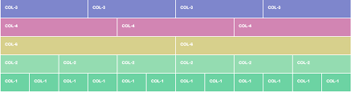
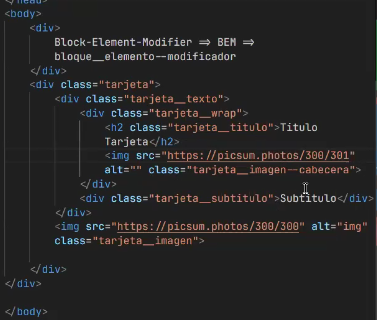
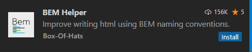
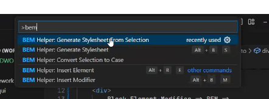
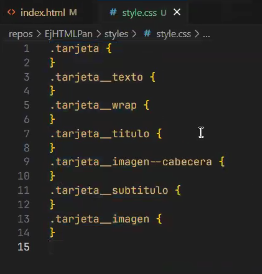

añadir video de grid en apartado 4.4 de HTML

Unidad 5. Hoja de estilos CSS

1. Conceptos básicos I
2. Conceptos básicos II
3. Reglas y especificidad de CSS
4. Modelo de caja
5. Posicionamiento de los elementos
6. Bootstrap

7. Conceptos básicos I

1.1 ¿Qué es el CSS?
Para entender cómo funciona el CSS (Cascade Style Sheet, u hoja de estilo en cascada) hay que recordar cómo se estructuran los elementos en el HTML:

Elementos de línea: Incluye <b>, <strong>, <i>, <em>, <a>, , ... Son elementos que, al añadirse al código, no crean un salto de línea.

Elementos de bloque: Incluye <h1>,<h6>, 
, 
, <ul>/<ol>... Estos elementos sí producen un salto de línea al añadirse al HTML.

¿Por qué es importante recordar esto? Porque el CSS funciona creando reglas que se aplican tanto a los elementos de línea como a los elementos de bloque, y hay que saber reconocer cuándo es recomendable aplicarlas a uno u otro elemento. Estas reglas indican cómo un determinado elemento debe mostrarse en el navegador.

La estructura de una regla CSS requiere de un selector y una declaración, así: p { font-family: Arial, sans-serif; }

El selector p indica que la regla se aplicará a todos los elementos 
 del HTML. La declaración {font-family: Aril, sans-serif;} indica que estilo habrá de aplicarse a estos elementos.

Es posible aplicar una regla a más de un elemento añadiendo una coma en el selector, así: p, h1, h2, h3 { font-family: Arial, sans-serif; }

También es posible añadir más de una propiedad dentro de la declaración, así:

p, h1, h2, h3 {

font-family: sans-serif;

font-weight: bold;

}

Para aplicar CSS a un documento HTML existen tres posibilidades:

In line
Esto es, dentro del propio documento HTML. Para ello basta con usar la etiqueta 

Externo
Es necesario añadir una etiqueta <link> dentro del <head>, junto con un atributo rel=”stylesheet” (indica la relación que tiene el archivo enlazado con el documento HTML, en este caso se trata de indicar que es una hoja de estilo), un atributo type=”text/css” (igual que en la opción anterior, indica que tipo de documento es el enlazado) y un atributo href=”” (que indica el directorio y el nombre del archivo enlazado, generalmente este aparece dentro de una carpeta css, y el archivo suele tener el nombre de style.css). Este es el mejor método para enlazar una hoja de estilos ya que puede ser compartida con el resto de archivos html. Ejemplo: <link rel="stylesheet" href="./css/style.css">

Injectado
Es el menos recomendable para usar puesto que el estilo solo afecta a la etiqueta donde se aplica. No es recomendable usarla por que al tener mayor peso que el estilo que generamos en el .css es muy difícil luego corregir dicho estilo y hacer un cambio sin tocar el html. Además de los estilos no debería encargarse el HTML si no el CSS. Ejemplo: 
Parrafo con estilos injectados

Es recomendable utilizar la segunda opción (externo) ya que, al tratarse de un documento externo, es posible aplicarlo a múltiples archivos HTML, eliminando las duplicidades y el trabajo extra de mantenimiento. Además hace que el código individual de cada archivo HTML se reduzca.

1.2 Selectores
Como se ha visto, la estructura básica del CSS requiere de un selector y una declaración. A continuación se muestra una lista con los principales tipos:

Selector universal: Se aplica a todos los elementos del documento, se crea así:

- {

padding: 0;

margin: 0;

}

Selector de etiqueta: Se aplica a los diferentes elementos o etiquetas de HTML, se usa así:

p, h1-h6 {}

Selector de clase: Se aplica exclusivamente a aquellos elementos que, en el HTML, tengan un atributo class=””, de dos maneras:

.nombredelaclase {}

p.nombredelaclase {}

/_ Se aplica a aquellos 
 (o cualquier otra etiqueta que aparezca por delante del punto) que lleven esa clase asociada. _/

Selector de ID: Se aplica a aquellos elementos con un id en el HTML, así se usa:

#nombredelid {}

Selector de “hijos”: Se aplica a todo aquel elemento que cumpla la condición de ser “hijo” directo (ser “hijo” de un elemento significa estar anidado dentro de ese elemento en el HTML, por ejemplo una etiqueta  dentro de una etiqueta 
) de otro elemento, así:

p>span {}

Selector de descendientes: Al igual que el Selector de “hijos” permite a apuntar a un elemento anidado dentro de otro elemento (en el HTML), pero en este caso no necesita ser un hijo “directo”. En este caso se apunta a una etiqueta <a> dentro de un 
 , pero esa etiqueta <a> podría estar incluida dentro de otras etiquetas (como un ), así:

p a {}

Selector de “parientes” adyacentes: Apunta a cualquier elemento que este a continuación de otro elementos (por ejemplo: un 
 que aparezca a continuación de un <h1> ), así:

h1+p {}

Selector de atributos: El último tipo de selectores avanzados lo forman los selectores de atributos, que permiten seleccionar elementos HTML en función de sus atributos y/o valores de esos atributos. Los cuatro tipos de selectores de atributos son:

[nombre_atributo] , selecciona los elementos que tienen establecido el atributo llamado nombre_atributo , independientemente de su valor.

[nombre_atributo=valor] , selecciona los elementos que tienen establecido un atributo llamado nombre_atributo con un valor igual a valor .

[nombre_atributo~=valor] , selecciona los elementos que tienen establecido un atributo llamado nombre_atributo y al menos uno de los valores del atributo es valor .

[nombre_atributo|=valor] , selecciona los elementos que tienen establecido un atributo llamado nombre_atributo y cuyo valor es una serie de palabras separadas con guiones, pero que comienza con valor . Este tipo de selector sólo es útil para los atributos de tipo lang que indican el idioma del contenido del elemento.

Ejemplos
/_ Se muestran de color azul todos los enlaces que tengan un atributo "class", independientemente de su valor _/

a[class] { color: blue; }

/_ Se muestran de color azul todos los enlaces que tengan un atributo "class" con el valor "externo" _/

a[class="externo"] { color: blue; }

/_ Se muestran de color azul todos los enlaces que apunten al sitio "http://www.ejemplo.com" _/

a[href="http://www.ejemplo.com"] { color: blue; }

1.3 Otros selectores
Pseudoselectores (pseudoclases)
Son los selectores que no seleccionan un elemento, sino un estado del elemento. Son selectores como :hover o :focus, selectores que sólo entran en acción cuando ponemos el puntero del mouse encima del elemento que lo define.

Ejemplo

div.miClase#miId{

    background: red;

}

div.miClase#miId:hover{

    background: blue;

}

Éstos serán nuestro pan y mantequilla a la hora de dar detalles a una página, como al añadir animaciones a un menú desplegable, o a botones, o para crear un checkbox personalizado.

Pseudoelementos
Éstos definen un set de elementos ya seleccionados, como por ejemplo ::first, ::nth-child() o ::after.

Elementos especiales
Hay varios selectores para cosas muy específicas o especiales, como por ejemplo el selector para la barra de scroll (::-webkit-scrollbar), el selector para imágenes rotas (:-moz-broken) y demás. Tienen un nicho muy pequeño, y por motivos de accesibilidad conviene no tocarlos demasiado.

Hay un set de elementos en desarrollo, como :where o :is, que están constantemente evolucionando. Conviene estar al tanto.

1.4 El estilo "en cascada"
Es importante entender cómo se aplica el estilo en cascada del CSS ya que, durante la creación de este, es más que probable que dos o más reglas entren en conflicto. Al entender cual se priorizará podremos escribir un código más limpio y con menos cantidad de líneas. Este es el orden en el que se aplican:

Última regla: La última regla que aparece en el código tendrá prioridad.

Especificidad: Cuanto más específica es una, más prioridad tendrá (por ejemplo si se apunta a un 
 y a un 
 con un id=””, este último tendrá más prioridad. Un id es más específico que un class y a su vez este es más específico que una etiqueta 
.

Además de todo lo anterior es posible añadir un !important a continuación de la propiedad para indicar que debe considerarse más importante que otra/s regla/s que puedan aplicarse. Se escribe así:

p { color: red !important; }

El uso de esta declaración está totalmente desaconsejado, puesto que puede dificultar mucho depurar los problemas con tu código y la única forma de sobreescribir un !important es añadiendo otro dentro de un selector con más especificidad o haciendo que aparezca después en el código, lo cual terminaría convirtiendo tu CSS en algo realmente difícil de mantener. La regla es no hacer uso de ellos salvo para casos extremos como por ejemplo sobreescribir estilos inline que te añada algún plugin externo.

Colisiones de estilos
En las hojas de estilos complejas, es habitual que varias reglas CSS se apliquen a un mismo elemento HTML. El problema de estas reglas múltiples es que se pueden dar colisiones como la del siguiente ejemplo:

p { color: red; }

p { color: blue; }

¿De qué color se muestra el párrafo anterior? CSS tiene un mecanismo de resolución de colisiones muy complejo y que tiene en cuenta el tipo de hoja de estilo que se trate (de navegador, de usuario o de diseñador), la importancia de cada regla y lo específico que sea el selector.

El método seguido por CSS para resolver las colisiones de estilos se muestra a continuación:

Determinar todas las declaraciones que se aplican al elemento para el medio CSS seleccionado.

Ordenar las declaraciones según su origen (CSS de navegador, de usuario o de diseñador) y su prioridad (palabra clave !important ).

Ordenar las declaraciones según lo específico que sea el selector. Cuanto más genérico es un selector, menos importancia tienen sus declaraciones.

Si después de aplicar las normas anteriores existen dos o más reglas con la misma prioridad, se aplica la que se indicó en último lugar.

Hasta que no se expliquen más adelante los conceptos de tipo de hoja de estilo y la prioridad, el mecanismo simplificado que se puede aplicar es el siguiente:

Cuanto más específico sea un selector, más importancia tiene su regla asociada.

A igual especificidad, se considera la última regla indicada.

Herencia
Cuando se aplica un determinado estilo (por ejemplo el estilo de la tipografía) a un selector que apunta a un elemento del HTML con múltiples elementos “child” , este se aplica a todos sus hijos por defecto. No todos los estilos se heredan por defecto, pero es posible forzar esto vía “inherit” , así:

body { padding: 10px; }

div { padding: inherit;}

Incompatibilidades entre navegadores
Como ya se ha comentado es recomendable testear el trabajo de manera regular en tantos navegadores como sea posible, así como SOs. También es recomendable usar IE como navegador “de base” para testear la web, ya que es (posiblemente) el peor navegador que nos vamos a encontrar. Si funciona en él, funciona en todos.

SELECTORES:

header ~ main {
explicarlo - selectores hermano, en el mismo nivel, pero siempre en cascada, de arriba hace abajo, no funciona de abajo hace arriba
}

luego referir la font deseada en la etiqueta
recomendable poner dos tipos de font

### @media screen and (max-width: )

#### Mobil:

max:550px
min:350px

#### Tablet :

min: 550px
max: 770px

#### Ordenador:

min: 778px (laptop)
max: 1266px (laptop)
max:1900px(desktop)

## ESTILOS DE FUENTES

### @font-face

Sirven para obtener tipos de font.
Ponerlas al principipo del codigo css.

### @import

@import url(para las fonts) para no poner la etiqueta `<link>` en html

    @import url(url de la pagina web)

## 2.1 Custom properties

Son propiedades que podemos añadir y usar como variables. Estas variables iran :root,:after o :before.

Se declaran con `--`

        :root,
        :after,
        :before {
        -- color : #eee;

        }

Y luego se llamarán de la siguiente manera

    Ejemplo:

        .clase {
            background-color: var (--color) ;
        }

Y así permitira que podamos poner el mismo valor a diferentes elementos

## 2.2 Fuentes y tipografías

Las fuentes en CSS se declaran con font-family, siempre que la fuente esté ya instalada en el sistema. Si no, podemos importarlas con @font-face.

Las propiedades más importantes para las fuentes son font-size, font-weight y line-height, además de font-family, claro.

## 2.3 Animaciones

### [Transition y transform](https://developer.mozilla.org/es/docs/Web/CSS/CSS_transitions/Using_CSS_transitions)

CSS nos permite animar nuestros elementos de forma bastante fácil.

Necesitamos un elemento que transicione de un estado a otro cuando ocurre una acción, como por ejemplo cuando pasamos el puntero por encima:

    .element{
        transition: .3s ease transform;

    }

    .element:hover{
        transform: scale(1.5);

    }

Hay diferentes tipos de transiciones:

- ease
- linear
- [Ver mas](https://developer.mozilla.org/es/docs/Web/CSS/CSS_transitions/Using_CSS_transitions)

Propiedades típicas que se animan: height o width, opacidad, transforms…

Propiedades que no pueden animarse: display, position, height %...

### Keyframes

Decalaramos lo que queremos que nuestra `@keyframe` haga al principio del codigo.

Existe una manera de aplicar animaciones de manera un poco más funcional:

@keyframes fade-in{

    from{

    opacity: 0;

}

to{

    opacity: 1;

}

}

Estos keyframes nos permiten crear animaciones que podremos aplicar más adelante a los elementos con animation: nombre timing fill.

#### @keyframe spin

    - @keyframe spin {
        0%{
            que queremos que haga al principio
            transform:ratate(0deg);

        }
        50%{
            a mitad
            opacity:0;

        }
        100%{
            y al final
            transform:ratate(360deg);

        }
    }

Y luegi vamos a la etiqueta deseada y pornemos

    h1{
        animation: 2s linear spin;
    }

y asi lo hariamos girar una vez, para que estuviera todo el rato girando añadimos `infinite`

    h1{
        animation: 2s linear spin infinite;
    }

## 2.4 Filtros de contenido

## Mensajes modales

mensajes que aparecen delante que te "ocultan" el contenido hasta que no aceptas, ejemplo: acepto las cookies, o hasta que no me subscriba.

background-image: linear-gradient ( dos colores )

### Filter

Podemos aplicar filtros simples a nuestro contenido con esta propiedad. Los filtros actualmente funcionales son:

- blur
- brightness
- contrast
- drop-shadow
- grayscale
- hue-rotate
- invert
- opacity
- saturate
- sepia

### Backdrop-filter

Son iguales que los filtros, pero en vez de aplicarse al contenido de dentro del elemento, se aplicará a todos los elementos que estén detrás.

### Gradientes

Podemos elegir de entre gradientes lineales, radiales, repetidos, y cónicos.

---

## Bootstrap:

[Bootstrap](https://getbootstrap.com/docs/5.3/getting-started/introduction/) es una libreria de css con muchisimas clases ya escritas para personalizar nuestras paginas web.
Está optimizada para funcionar con un grid de 12 columnas. Se puede elegir como sean las columnas.

    Ejemplo: 2, 2, 2, 2, 2, 2 ; o de 6 y 6.

- Se peude o descargar [la libreria entera](https://github.com/twbs/bootstrap/releases/download/v5.3.3/bootstrap-5.3.3-dist.zip) y adjuntarla a la carpeta

- O usarlo mediante una [CDN] (https://es.wikipedia.org/wiki/Red_de_distribuci%C3%B3n_de_contenidos) y añadirla a la parte del `<head>` de html mediante una etiqueta `<link>`

## BEM

[Que es BEM y como utilizarlo en CSS](https://victorroblesweb.es/2022/08/03/que-es-bem-y-como-utilizarlo-en-css/)

BEM: La metodología BEM (bloque, elemento, modificador) es una forma de escribir selectores CSS de forma más rápida y sin tener que repetir el código.

    bloque__elemento--modificador

Se divide en tres reglas:

Bloque: Es el contenedor de los demás elementos.
Elemento: Son las etiquetas de dentro de un bloque.
Modificador: Es una clase que diferencia a ese elemento de otro.

[BEM](https://getbem.com/)

Extension en Visual Studio Code (BEM Helper)

En os comandos seleccionamos bem helper <button>CTRL</button> + <button> shift </button> + P

Creamos archivo CSS

Y automaticamente nos creará el archivo con todas las clases ya en él.

